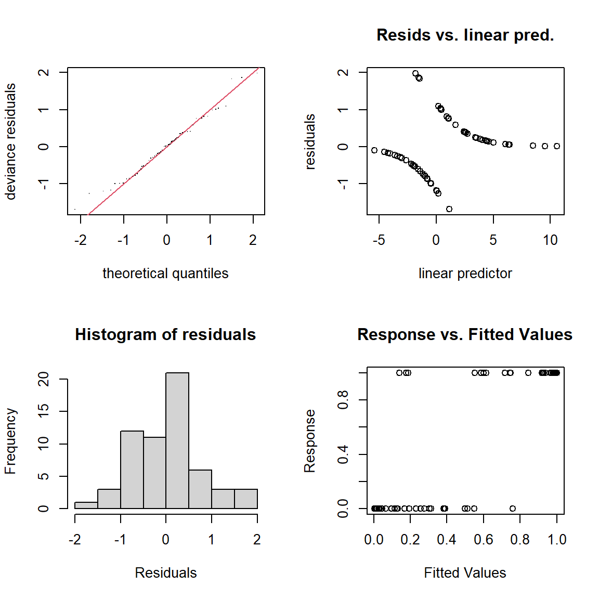
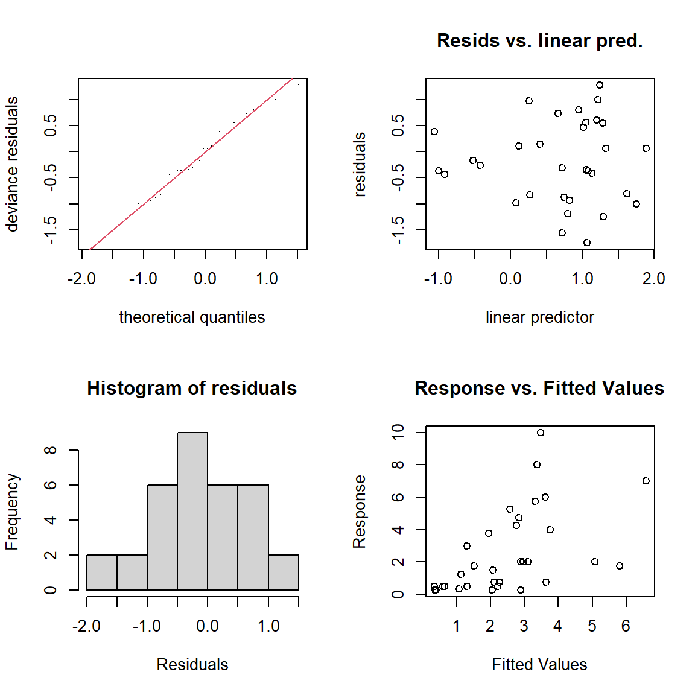
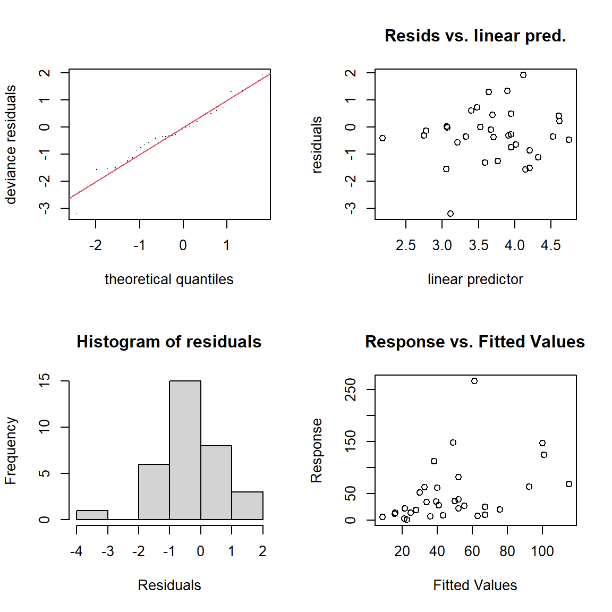
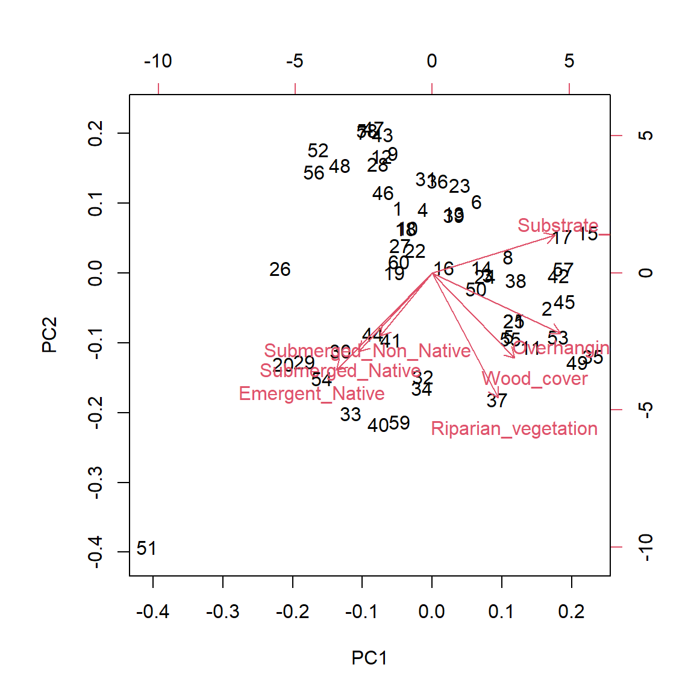

# Setup

::: {.cell .hidden}

```{.r .cell-code .hidden}
#| label: setup
#| include: false

knitr::opts_knit$set(root.dir = normalizePath(".."))
options(warn = -1)
packages <- c(
  "here","kableExtra","emmeans","rstatix","multcompView","brglm2","patchwork","gratia","pROC","caret",
  "mgcv","tidyr","purrr","corrplot","glmmTMB","performance","tibble","tidyverse",
  "dplyr","writexl","readxl","lubridate")

quiet_load <- function(pkg) {
  if (!requireNamespace(pkg, quietly = TRUE)) {
    suppressWarnings(suppressMessages(install.packages(pkg, dependencies = TRUE)))
  }
  suppressPackageStartupMessages(require(pkg, character.only = TRUE, quietly = TRUE))
  invisible(TRUE)
}

invisible(lapply(packages, quiet_load))
```

::: {.cell-output .cell-output-stdout}

```
systemfonts and textshaping have been compiled with different versions of Freetype. Because of this, textshaping will not use the font cache provided by systemfonts
```


:::

```{.r .cell-code .hidden}
#| label: setup
#| include: false

exc_file_dir <- "data/raw/Natural_habitat.xlsx"
der_data_dir <- "data/derived"
out_dir      <- "outputs"

dir.create(exc_file_dir, showWarnings = FALSE, recursive = TRUE)
dir.create(der_data_dir, showWarnings = FALSE, recursive = TRUE)
dir.create(out_dir,      showWarnings = FALSE, recursive = TRUE)

Site_info          <- read_excel(exc_file_dir, sheet = "Site_info")
Monitoring_data    <- read_excel(exc_file_dir, sheet = "Monitoring_data")
Weed_data          <- read_excel(exc_file_dir, sheet = "Weed_data")  %>% dplyr::select(-starts_with("..."))
```

::: {.cell-output .cell-output-stderr .hidden}

```
New names:
• `` -> `...8`
• `` -> `...9`
• `` -> `...10`
• `` -> `...11`
• `` -> `...12`
```


:::

```{.r .cell-code .hidden}
#| label: setup
#| include: false

Fish_data          <- read_excel(exc_file_dir, sheet = "Fish_data")  %>% dplyr::select(-starts_with("..."))
```

::: {.cell-output .cell-output-stderr .hidden}

```
New names:
• `` -> `...22`
• `` -> `...23`
• `` -> `...24`
• `` -> `...25`
• `` -> `...26`
• `` -> `...27`
• `` -> `...28`
```


:::

```{.r .cell-code .hidden}
#| label: setup
#| include: false

Macroinvertebrates <- read_excel(exc_file_dir, sheet = "Macroinvertebrates")

Site_info          <- Site_info          |> dplyr::filter(!stringr::str_ends(Monitoring_ID, "_1"))
Monitoring_data    <- Monitoring_data    |> dplyr::filter(!stringr::str_ends(Monitoring_ID, "_1"))
Weed_data          <- Weed_data          |> dplyr::filter(!stringr::str_ends(Monitoring_ID, "_1"))
Fish_data          <- Fish_data          |> dplyr::filter(!stringr::str_ends(Monitoring_ID, "_1"))
Macroinvertebrates <- Macroinvertebrates |> dplyr::filter(!stringr::str_ends(Monitoring_ID, "_1"))

# Save as csv to derived
write.csv(Site_info,          file.path(der_data_dir, "Site_info.csv"),          row.names = FALSE)
write.csv(Monitoring_data,    file.path(der_data_dir, "Monitoring_data.csv"),    row.names = FALSE)
write.csv(Weed_data,          file.path(der_data_dir, "Weed_data.csv"),          row.names = FALSE)
write.csv(Fish_data,          file.path(der_data_dir, "Fish_data.csv"),          row.names = FALSE)
write.csv(Macroinvertebrates, file.path(der_data_dir, "Macroinvertebrates.csv"), row.names = FALSE)

# Reproducibility note 
# The sections above require data/raw/Natural_habitat.xlsx (not tracked).
# To reproduce analyses and figures without the raw Excel file,
# run from here using the derived CSVs in data/derived/:

Site_info          <- read.csv(file.path(der_data_dir, "Site_info.csv"))
Monitoring_data    <- read.csv(file.path(der_data_dir, "Monitoring_data.csv"))
Weed_data          <- read.csv(file.path(der_data_dir, "Weed_data.csv"))
Fish_data          <- read.csv(file.path(der_data_dir, "Fish_data.csv"))
Macroinvertebrates <- read.csv(file.path(der_data_dir, "Macroinvertebrates.csv"))

# Set plot theme
base_theme_bw <- theme_classic() +
  theme(
    text = element_text(family = "Arial", size = 8),
    axis.title = element_text(face = "plain"),
    axis.text = element_text(face = "plain"),
    plot.title = element_text(face = "plain"),
    strip.text = element_text(face = "plain"),
    panel.border = element_rect(colour = "black", fill = NA, linewidth = 0.3)
  )

theme_set(base_theme_bw)

clean_smooth_title <- function(x) {
  x <- gsub("^s\\((.*)\\)$", "\\1", x)
  x <- gsub("_", " ", x)
  x
}
```
:::


# CPUE and BPUE derivation
## Length–weight model and predicted weights

::: {#cell-fig-length-weight .cell}

```{.r .cell-code .hidden}
#| label: fig-length-weight
#| include: true
#| fig-width: 7
#| fig-height: 5
#| fig-cap: "Length–weight relationship used to estimate missing kōura weights. Observed (measured) and model-predicted body weights are shown in relation to orbital carapace length (OCL). The log₁₀–log₁₀ regression was fitted to individuals with both length and weight measurements (n = 240) and used to estimate missing weights (n = 81). Predicted values were back-transformed using a lognormal bias correction factor. The fitted regression equation is shown on the plot."

lw_model <- lm(
log10(Weight_g) ~ log10(Length_mm),
data = Fish_data,
subset = Species_name == "Freshwater_crayfish" | Maori_name == "Kōura",
na.action = na.exclude
)

sigma_log10 <- sigma(lw_model)
c <- 10^(0.5 * sigma_log10^2)

Fish_data <- Fish_data |>
mutate(
is_koura = Species_name == "Freshwater_crayfish" | Maori_name == "Kōura",
Predicted_weight = case_when(
!is.na(Weight_g) ~ Weight_g,
is_koura ~ {
pred_log <- predict(lw_model, newdata = pick(everything()))
10^(pred_log) * c
},
TRUE ~ NA_real_
),
Weight_source = case_when(
is_koura & !is.na(Weight_g) ~ "measured",
is_koura & is.na(Weight_g) ~ "predicted",
TRUE ~ NA_character_
)
)

a <- coef(lw_model)[1]
b <- coef(lw_model)[2]
formula_text <- paste0(
"log10(Weight[g]) = ", round(a, 3), " + ", round(b, 3),
" * log10(OCL Length[mm])"
)

length_weight_plot <- ggplot(
Fish_data |> dplyr::filter(is_koura),
aes(x = Length_mm, y = Predicted_weight, shape = Weight_source)) +
geom_point(size = 2.2, colour = "black", stroke = 0.6) +
scale_shape_manual(values = c("measured" = 16, "predicted" = 1)) +
labs(x = "OCL length (mm)", y = "Weight (g)", shape = "Weight source") +
annotate("text", x = Inf, y = Inf, label = formula_text, hjust = 1.1, vjust = 1.3, size = 3) 

ggsave(filename = file.path(out_dir, "fig-length-weight.png"), plot = length_weight_plot, width = 7, height = 5, dpi = 1200, create.dir = TRUE)

length_weight_plot
```

::: {.cell-output-display}
{#fig-length-weight width=672}
:::
:::


## CPUE and BPUE calculations

::: {.cell .hidden}

```{.r .cell-code .hidden}
#| label: cpue-bpue-calculations
#| include: false

CPUE_BPUE_legacy <- Fish_data %>%
filter(!is.na(Species)) %>%
group_by(Monitoring_ID, Species, Net_type) %>%
dplyr::reframe(
Total_Individuals = sum(Amount, na.rm = TRUE),
Total_Weight      = sum(Predicted_weight, na.rm = TRUE),
Total_Effort      = dplyr::first(Amount_nets),
CPUE              = Total_Individuals / Total_Effort,
BPUE              = Total_Weight / Total_Effort,
Mean_Length       = mean(Length_mm, na.rm = TRUE),
Min_Length        = ifelse(all(is.na(Length_mm)), NA, min(Length_mm, na.rm = TRUE)),
Max_Length        = ifelse(all(is.na(Length_mm)), NA, max(Length_mm, na.rm = TRUE)),
Mean_Weight       = mean(Predicted_weight, na.rm = TRUE),
Min_Weight        = ifelse(all(is.na(Predicted_weight)), NA, min(Predicted_weight, na.rm = TRUE)),
Max_Weight        = ifelse(all(is.na(Predicted_weight)), NA, max(Predicted_weight, na.rm = TRUE))
)

CPUE_BPUE_weighted <- CPUE_BPUE_legacy %>%
group_by(Monitoring_ID, Species) %>%
summarise(
Total_Individuals       = sum(Total_Individuals, na.rm = TRUE),
Total_Weight            = sum(Total_Weight,      na.rm = TRUE),
Weighted_CPUE_numerator = sum(CPUE * Total_Effort,  na.rm = TRUE),
Weighted_BPUE_numerator = sum(BPUE * Total_Effort,  na.rm = TRUE),
Total_Effort_sum        = sum(Total_Effort,         na.rm = TRUE),
Mean_Length             = mean(Mean_Length, na.rm = TRUE),
Min_Length              = ifelse(all(is.na(Min_Length)), NA, min(Min_Length, na.rm = TRUE)),
Max_Length              = ifelse(all(is.na(Max_Length)), NA, max(Max_Length, na.rm = TRUE)),
Mean_Weight             = mean(Mean_Weight, na.rm = TRUE),
Min_Weight              = ifelse(all(is.na(Min_Weight)), NA, min(Min_Weight, na.rm = TRUE)),
Max_Weight              = ifelse(all(is.na(Max_Weight)), NA, max(Max_Weight, na.rm = TRUE)),
.groups = "drop"
) %>%
mutate(
Total_Effort_sum = ifelse(Monitoring_ID %in% c("96_0", "101_0", "117_1", "119_1"), 3, 4),
Weighted_CPUE    = Weighted_CPUE_numerator / Total_Effort_sum,
Weighted_BPUE    = Weighted_BPUE_numerator / Total_Effort_sum
)

species_presence_absence <- Fish_data %>%
filter(!is.na(Species)) %>%
distinct(Monitoring_ID, Species) %>%
mutate(Presence = 1) %>%
pivot_wider(
names_from  = Species,
values_from = Presence,
values_fill = list(Presence = 0),
names_prefix = "Presence_"
) %>%
mutate(Predator_Fish_Presence = pmax(Presence_Trout, Presence_Eel, Presence_Catfish))

CPUE_BPUE_weighted_summary <- CPUE_BPUE_weighted %>%
pivot_wider(
names_from  = Species,
values_from = c(
Total_Individuals, Weighted_CPUE, Weighted_BPUE, Total_Weight,
Mean_Length, Mean_Weight, Weighted_CPUE_numerator, Weighted_BPUE_numerator,
Total_Effort_sum, Min_Length, Max_Length, Min_Weight, Max_Weight
),
names_sep   = "_",
values_fill = list(Total_Individuals = 0, Weighted_CPUE = 0, Weighted_BPUE = 0)
) %>%
mutate(
Richness  = rowSums(dplyr::select(., starts_with("Total_Individuals_")) > 0),
Abundance = rowSums(dplyr::select(., starts_with("Total_Individuals_") & !ends_with(c("_Bullies", "_Common_smelt"))))
)
```
:::


# Combined dataset and habitat classification

::: {.cell .hidden}

```{.r .cell-code .hidden}
#| label: combine-dataframes
#| include: false

unit_metadata <- Monitoring_data %>%
dplyr::select(Parameter, Unit) %>%
distinct()

Monitoring_summary <- Monitoring_data %>%
dplyr::select(-Group, -Notes, -Unit) %>%
pivot_wider(
names_from  = c(Parameter),
values_from = Value,
values_fill = list(Value = NA)
) %>%
mutate(across(
c(
Bottom_visible, Water_clarity, Depth_10m, Slope, Riparian_vegetation, Vegetation_nearby,
Overhanging_trees, Erosion, Structure, Bedrock, Boulders, Cobble, Gravel,
Sand, Mud, Organic_matter, Rock_size, Temperature, DO_mgl, DO_percent,
Conductivity, Specific_conductivity, pH, Wood_cover
),
~ as.numeric(.)
))

Weed_summary <- Weed_data %>%
group_by(Monitoring_ID, Weed_Type, Native_Status) %>%
summarise(Total_Cover = sum(Percentage_Cover, na.rm = TRUE), .groups = "drop") %>%
pivot_wider(
names_from  = c(Weed_Type, Native_Status),
values_from = Total_Cover,
values_fill = 0
)

Macroinvertebrates_sum <- Macroinvertebrates %>%
group_by(Monitoring_ID, Species) %>%
summarise(Total_amount = sum(Amount, na.rm = TRUE), .groups = "drop") %>%
pivot_wider(names_from = c(Species), values_from = Total_amount, values_fill = 0) %>%
mutate(
Invertebrates_Richness  = rowSums(dplyr::select(., -Monitoring_ID) > 0),
Invertebrates_Abundance = rowSums(dplyr::select(., -Monitoring_ID))
)

Monitoring_CPUE_data <- Site_info %>%
left_join(Monitoring_summary, by = "Monitoring_ID") %>%
left_join(
Weed_summary %>% dplyr::select(
Monitoring_ID,
Emergent_Native, Emergent_Non_Native,
Submerged_Native, Submerged_Non_Native, Turf_Native
),
by = "Monitoring_ID"
) %>%
left_join(CPUE_BPUE_weighted_summary, by = "Monitoring_ID") %>%
left_join(species_presence_absence, by = "Monitoring_ID") %>%
left_join(Macroinvertebrates_sum, by = "Monitoring_ID")

Monitoring_CPUE_data <- Monitoring_CPUE_data %>%
  mutate(
    Presence_rocks = if_else(Cobble > 1 | Boulders > 1, 1, 0),
    Slope_5m       = 5 / Distance_5m,
    Site_ID_       = Site_ID.x - 60,
    Monitoring_ID_ = paste0(
      as.numeric(sub("_.*", "", Monitoring_ID)) - 60,
      sub("^[^_]*", "", Monitoring_ID)
    ),
    Monitoring     = sub(".*?_", "", Monitoring_ID),
    Date           = as.Date(Date_Time),
    Time           = format(as.POSIXct(Date_Time), "%H:%M:%S"),
    Year           = lubridate::year(Date_Time),
    Month          = lubridate::month(Date_Time, label = TRUE),
    Day            = lubridate::day(Date_Time),
    Season         = case_when(
      Month %in% c("Dec", "Jan", "Feb") ~ "Summer",
      Month %in% c("Mar", "Apr", "May") ~ "Autumn",
      Month %in% c("Jun", "Jul", "Aug") ~ "Winter",
      Month %in% c("Sep", "Oct", "Nov") ~ "Spring",
      TRUE ~ NA_character_
    ),
    Date_Time_Numeric = as.numeric(Date_Time)
  )

habitat_classification <- Monitoring_CPUE_data %>%
dplyr::select(
Monitoring_ID, DHT, Lake,
Bedrock, Boulders, Cobble, Gravel, Sand, Mud, Organic_matter,
Emergent_Native, Emergent_Non_Native,
Submerged_Native, Submerged_Non_Native, Wood_cover
) %>%
pivot_longer(
cols = c(
Bedrock, Boulders, Cobble, Gravel, Sand, Mud, Organic_matter,
Emergent_Native, Emergent_Non_Native,
Submerged_Native, Submerged_Non_Native, Wood_cover
),
names_to = "Type",
values_to = "Percentage"
) %>%
group_by(Monitoring_ID) %>%
summarise(
Rocky_Percentage = sum(Percentage[Type %in% c("Bedrock", "Boulders", "Cobble")], na.rm = TRUE),
Sand_Percentage  = sum(Percentage[Type == "Sand"], na.rm = TRUE),
Mud_Percentage   = sum(Percentage[Type %in% c("Mud", "Organic_matter")], na.rm = TRUE),
Emergent_Percentage = sum(Percentage[Type == "Emergent_Native"], na.rm = TRUE),
Substrate_index = sum(
0.08 * Percentage[Type == "Bedrock"] +
0.07 * Percentage[Type == "Boulders"] +
0.06 * Percentage[Type == "Cobble"] +
0.04 * Percentage[Type == "Gravel"] +
0.03 * Percentage[Type == "Sand"] +
0.02 * Percentage[Type == "Organic_matter"] +
0.01 * Percentage[Type == "Mud"],
na.rm = TRUE
),
Substrate_CV = {
substrate_vals <- Percentage[Type %in% c("Bedrock", "Boulders", "Cobble", "Gravel", "Sand", "Mud", "Organic_matter")]
substrate_vals <- substrate_vals[!is.na(substrate_vals)]
if (length(substrate_vals) > 1 && mean(substrate_vals) > 0) {
sd(substrate_vals) / mean(substrate_vals)
} else {
NA_real_
}
},
.groups = "drop"
) %>%
mutate(
Habitat_Type = case_when(
Rocky_Percentage > 25 ~ "Rocky",
Emergent_Percentage > 25 ~ "Emergent Macrophyte",
Sand_Percentage >= Mud_Percentage ~ "Sandy",
TRUE ~ "Muddy"
)
) %>%
dplyr::select(Monitoring_ID, Habitat_Type, Substrate_index, Substrate_CV)

Monitoring_CPUE_data <- Monitoring_CPUE_data %>%
left_join(habitat_classification, by = "Monitoring_ID")

#writexl::write_xlsx(Monitoring_CPUE_data, file.path(der_data_dir, "Monitoring_CPUE_data.xlsx"))
#write.csv(Monitoring_CPUE_data, file.path(der_data_dir, "Monitoring_CPUE_data.csv"), row.names = FALSE)
#write.csv(habitat_classification, file.path(der_data_dir, "habitat_classification.csv"), row.names = FALSE)

#head(Monitoring_CPUE_data)
```
:::


## habitat-correlation

::: {.cell}

```{.r .cell-code .hidden}
#| label: habitat-correlation
#| include: true

cor(habitat_classification$Substrate_index,
habitat_classification$Substrate_CV,
use = "complete.obs")
```

::: {.cell-output .cell-output-stdout}

```
[1] -0.4785045
```


:::
:::


# Lake overview table

::: {#tbl-lake-overview .cell tbl-cap='Physical, morphometric, and trophic characteristics of the five Rotorua Te Arawa lakes surveyed, including sampling dates and number of littoral sites sampled per lake. Lake surface area, perimeter length, catchment area, depth, elevation, mixing regime, and trophic state for 2024, values are derived from (@LAWA2025) database.'}

```{.r .cell-code .hidden}
#| label: tbl-lake-overview
#| echo: FALSE
#| tbl-cap: "Physical, morphometric, and trophic characteristics of the five Rotorua Te Arawa lakes surveyed, including sampling dates and number of littoral sites sampled per lake. Lake surface area, perimeter length, catchment area, depth, elevation, mixing regime, and trophic state for 2024, values are derived from (@LAWA2025) database."

lake_data <- data.frame(
  `Lake name` = c("Rotorua", "Rotoiti", "Rotoehu", "Rotomā", "Ōkāreka"),
  `Sampling date (number of sites)` = c("20/02/2025 (12)", "15/01/2025 (12)", "10/12/2024 (12)", "6/11/2024 (12)", "31/10/2024 (10), 22/01/2025 (2)"),
  `Surface area (km²)` = c(81, 34, 8, 11, 3),
  `Perimeter length (km)` = c(45, 61, 40, 24, 11),
  `Catchment area size (km²)` = c(508, 123.7, 49.2, 27.8, 19.6),
  `Mean depth (m)` = c(11, 31.5, 8, 36.9, 20),
  `Maximum depth (m)` = c(45, 124, 13.5, 83, 33.5),
  `Elevation (m)` = c(280, 279, 295, 316, 355),
  `Mixing regime` = c("Polymictic", "Stratified", "Polymictic", "Stratified", "Stratified"),
  `Trophic state` = c("Eutrophic", "Mesotrophic", "Eutrophic", "Oligotrophic", "Mesotrophic")
)

write.csv(lake_data,file = file.path(out_dir, "tbl-lake-overview.csv"),
  row.names = FALSE)

kable(lake_data)
```

::: {.cell-output-display}


|Lake.name |Sampling.date..number.of.sites. | Surface.area..km..| Perimeter.length..km.| Catchment.area.size..km..| Mean.depth..m.| Maximum.depth..m.| Elevation..m.|Mixing.regime |Trophic.state |
|:---------|:-------------------------------|------------------:|---------------------:|-------------------------:|--------------:|-----------------:|-------------:|:-------------|:-------------|
|Rotorua   |20/02/2025 (12)                 |                 81|                    45|                     508.0|           11.0|              45.0|           280|Polymictic    |Eutrophic     |
|Rotoiti   |15/01/2025 (12)                 |                 34|                    61|                     123.7|           31.5|             124.0|           279|Stratified    |Mesotrophic   |
|Rotoehu   |10/12/2024 (12)                 |                  8|                    40|                      49.2|            8.0|              13.5|           295|Polymictic    |Eutrophic     |
|Rotomā    |6/11/2024 (12)                  |                 11|                    24|                      27.8|           36.9|              83.0|           316|Stratified    |Oligotrophic  |
|Ōkāreka   |31/10/2024 (10), 22/01/2025 (2) |                  3|                    11|                      19.6|           20.0|              33.5|           355|Stratified    |Mesotrophic   |


:::
:::


# Overview of environmental and biotic variables 

::: {#tbl-environmental-biotic-overview .cell tbl-cap='Overview of environmental and biotic variables measured at littoral sampling sites, including variable descriptions, units, and hypothesised relevance for kōura. Variables were selected a priori based on known habitat requirements, physiological constraints, and potential biotic interactions influencing kōura occurrence, abundance, and biomass in lake littoral zones.'}

```{.r .cell-code .hidden}
#| label: tbl-environmental-biotic-overview
#| echo: FALSE
#| tbl-cap: "Overview of environmental and biotic variables measured at littoral sampling sites, including variable descriptions, units, and hypothesised relevance for kōura. Variables were selected a priori based on known habitat requirements, physiological constraints, and potential biotic interactions influencing kōura occurrence, abundance, and biomass in lake littoral zones."

biotic_vars <- data.frame(
  Variable = c(
    "Lake identity (LID)",
    "Substrate index",
    "Slope",
    "Riparian vegetation",
    "Overhanging trees",
    "Wood cover",
    "Emergent and submerged vegetation",
    "Temperature",
    "Dissolved oxygen",
    "Specific conductivity",
    "pH",
    "Fish presence"
  ),
  `Description / Unit` = c(
    "Categorical variable identifying lake",
    "Index based on % cover of bedrock, boulders, cobble, gravel, sand, mud, and organic matter",
    "Slope from shoreline to the 5 m depth contour",
    "Percentage cover of vegetation growing in the riparian zone",
    "Percentage cover of trees hanging over the shoreline",
    "Cover of wooden logs and tree branches in the sample site",
    "Percentage cover of vegetation divided over emergent/submerged and native/non-native species",
    "Temperature of surface water in °C",
    "Dissolved oxygen concentration in mg L⁻¹",
    "Electrical conductivity of the water in µS cm⁻¹",
    "Acidity or alkalinity of the water",
    "Presence/absence of selected native and non-native fish species"
  ),
  `Hypothesised importance for kōura` = c(
    "Captures unmeasured lake specific differences in water chemistry, productivity, and catchment characteristics.",
    "Important for burrowing and shelter availability. Coarser substrates increase shelter availability through more crevices.",
    "Steeper slopes facilitate access to deeper water during daylight refuging and associate with coarser substrates.",
    "Contributes detrital inputs, bank stability, and shading at the water’s edge.",
    "Provides direct shading and structural inputs into littoral habitats.",
    "Provides physical structure creating refuge spaces and supports macroinvertebrate prey availability.",
    "Native vegetation provides cover and food source; non-native may alter movement and habitat conditions.",
    "Influences metabolic rate, activity, physiological stress, and habitat suitability.",
    "Essential for respiration; reduced oxygen may constrain activity and habitat use.",
    "Reflects overall lake productivity, supporting food availability.",
    "Influences moulting success and exoskeleton strength, affected by acidity or calcium levels.",
    "Fish act as predators, competitors, or indirectly modify habitat structure."
  ),
  References = c(
    "Zuur et al., (2009)",
    "Usio & Townsend, (2000); Kusabs et al., (2015b)",
    "Devcich, (1979); Kusabs et al., (2015b)",
    "Parkyn et al., (2002)",
    "Smith et al., (1996); Vedia et al., (2017)",
    "Parkyn et al., (2009)",
    "Coffey & Clayton, (1988); Kusabs & Quinn, (2009)",
    "Devcich, (1979); Hammond et al., (2006); Parkyn et al., (2002); Parkyn & Collier, (2002); Angilletta et al., (2004)",
    "Hammond et al., (2006); Broughton et al., (2017)",
    "Devcich, (1979)",
    "Olsson et al., (2006)",
    "Shave et al., (1994); Barnes, (1996); Usio & Townsend, (2000); Barnes & Hicks, (2003)"
  )
)

write.csv(biotic_vars,file = file.path(out_dir, "tbl-environmental-biotic-overview.csv"),
  row.names = FALSE)

kable(biotic_vars)
```

::: {.cell-output-display}


|Variable                          |Description...Unit                                                                           |Hypothesised.importance.for.kōura                                                                                         |References                                                                                                          |
|:---------------------------------|:--------------------------------------------------------------------------------------------|:-------------------------------------------------------------------------------------------------------------------------|:-------------------------------------------------------------------------------------------------------------------|
|Lake identity (LID)               |Categorical variable identifying lake                                                        |Captures unmeasured lake specific differences in water chemistry, productivity, and catchment characteristics.            |Zuur et al., (2009)                                                                                                 |
|Substrate index                   |Index based on % cover of bedrock, boulders, cobble, gravel, sand, mud, and organic matter   |Important for burrowing and shelter availability. Coarser substrates increase shelter availability through more crevices. |Usio & Townsend, (2000); Kusabs et al., (2015b)                                                                     |
|Slope                             |Slope from shoreline to the 5 m depth contour                                                |Steeper slopes facilitate access to deeper water during daylight refuging and associate with coarser substrates.          |Devcich, (1979); Kusabs et al., (2015b)                                                                             |
|Riparian vegetation               |Percentage cover of vegetation growing in the riparian zone                                  |Contributes detrital inputs, bank stability, and shading at the water’s edge.                                             |Parkyn et al., (2002)                                                                                               |
|Overhanging trees                 |Percentage cover of trees hanging over the shoreline                                         |Provides direct shading and structural inputs into littoral habitats.                                                     |Smith et al., (1996); Vedia et al., (2017)                                                                          |
|Wood cover                        |Cover of wooden logs and tree branches in the sample site                                    |Provides physical structure creating refuge spaces and supports macroinvertebrate prey availability.                      |Parkyn et al., (2009)                                                                                               |
|Emergent and submerged vegetation |Percentage cover of vegetation divided over emergent/submerged and native/non-native species |Native vegetation provides cover and food source; non-native may alter movement and habitat conditions.                   |Coffey & Clayton, (1988); Kusabs & Quinn, (2009)                                                                    |
|Temperature                       |Temperature of surface water in °C                                                           |Influences metabolic rate, activity, physiological stress, and habitat suitability.                                       |Devcich, (1979); Hammond et al., (2006); Parkyn et al., (2002); Parkyn & Collier, (2002); Angilletta et al., (2004) |
|Dissolved oxygen                  |Dissolved oxygen concentration in mg L⁻¹                                                     |Essential for respiration; reduced oxygen may constrain activity and habitat use.                                         |Hammond et al., (2006); Broughton et al., (2017)                                                                    |
|Specific conductivity             |Electrical conductivity of the water in µS cm⁻¹                                              |Reflects overall lake productivity, supporting food availability.                                                         |Devcich, (1979)                                                                                                     |
|pH                                |Acidity or alkalinity of the water                                                           |Influences moulting success and exoskeleton strength, affected by acidity or calcium levels.                              |Olsson et al., (2006)                                                                                               |
|Fish presence                     |Presence/absence of selected native and non-native fish species                              |Fish act as predators, competitors, or indirectly modify habitat structure.                                               |Shave et al., (1994); Barnes, (1996); Usio & Townsend, (2000); Barnes & Hicks, (2003)                               |


:::
:::


# Environmental and fish summaries (tables)

::: {#tbl-env-fish-summary .cell tbl-cap='Distribution of environmental and biotic variables measured at littoral sampling sites across five Te Arawa lakes in the Rotorua region of Aotearoa New Zealand.'}

```{.r .cell-code .hidden}
#| label: tbl-env-fish-summary
#| include: true
#| tbl-cap: "Distribution of environmental and biotic variables measured at littoral sampling sites across five Te Arawa lakes in the Rotorua region of Aotearoa New Zealand."

M_C_data <- Monitoring_CPUE_data
lake_order <- c("Rotorua", "Rotoiti", "Rotoehu", "Rotomā", "Ōkāreka")
M_C_data$Lake <- factor(M_C_data$Lake, levels = lake_order)

ci95 <- function(x) {
  x <- x[!is.na(x)]
  n <- length(x)
  if (n < 2) return(c(NA_real_, NA_real_))
  se <- sd(x) / sqrt(n)
  tcrit <- qt(0.975, df = n - 1)
  m <- mean(x)
  c(m - tcrit * se, m + tcrit * se)
}

unit_lookup <- Monitoring_data %>%
  dplyr::select(Parameter, Unit) %>%
  dplyr::distinct() %>%
  dplyr::mutate(
    Variable = dplyr::case_when(
      Parameter == "Riparian_vegetation"       ~ "Riparian_vegetation",
      Parameter == "Overhanging_trees"         ~ "Overhanging_trees",
      Parameter == "Wood_cover"                ~ "Wood_cover",
      Parameter == "Temperature"               ~ "Temperature",
      Parameter == "DO_mgl"                    ~ "DO_mgl",
      Parameter == "pH"                        ~ "pH",
      Parameter == "Specific_conductivity"     ~ "Specific_conductivity",
      Parameter == "Substrate_index"           ~ "Substrate_index",
      Parameter == "Slope_5m"                  ~ "Slope_5m",
      TRUE ~ NA_character_
    )
  ) %>%
  dplyr::filter(!is.na(Variable)) %>%
  dplyr::select(Variable, Unit) %>%
  dplyr::distinct()

# Add units for derived variables (not in Monitoring_data)
derived_units <- tibble::tibble(
  Variable = c("Emergent_vegetation", "Submerged_vegetation"),
  Unit     = c("%", "%")
)

# Fish presence units (binary)
fish_units <- tibble::tibble(
  Variable = c(
    "Presence_Eel","Presence_Common_smelt","Presence_Catfish",
    "Presence_Goldfish","Presence_Kōaro","Presence_Trout"
  ),
  Unit = ""
)

unit_lookup_all <- dplyr::bind_rows(unit_lookup, derived_units, fish_units) %>%
  dplyr::distinct(Variable, .keep_all = TRUE)

# ---- Environmental summary ----
Env_data <- M_C_data %>%
  dplyr::mutate(
    Emergent_vegetation  = Emergent_Native + Emergent_Non_Native,
    Submerged_vegetation = Submerged_Native + Submerged_Non_Native
  ) %>%
  dplyr::select(
    Lake, Substrate_index, Slope_5m, Riparian_vegetation, Overhanging_trees, Wood_cover,
    Temperature, DO_mgl, pH, Specific_conductivity, Emergent_vegetation, Submerged_vegetation
  ) %>%
  tidyr::pivot_longer(-Lake, names_to = "Variable", values_to = "Value")

Env_summary_table <- Env_data %>%
  dplyr::group_by(Lake, Variable) %>%
  dplyr::summarise(
    n       = sum(!is.na(Value)),
    Mean    = mean(Value, na.rm = TRUE),
    Median  = median(Value, na.rm = TRUE),
    Min     = min(Value, na.rm = TRUE),
    Max     = max(Value, na.rm = TRUE),
    CI_low  = ci95(Value)[1],
    CI_high = ci95(Value)[2],
    .groups = "drop"
  )

Env_summary_all <- Env_data %>%
  dplyr::group_by(Variable) %>%
  dplyr::summarise(
    Lake    = "All lakes",
    n       = sum(!is.na(Value)),
    Mean    = mean(Value, na.rm = TRUE),
    Median  = median(Value, na.rm = TRUE),
    Min     = min(Value, na.rm = TRUE),
    Max     = max(Value, na.rm = TRUE),
    CI_low  = ci95(Value)[1],
    CI_high = ci95(Value)[2],
    .groups = "drop"
  ) %>%
  dplyr::select(Lake, dplyr::everything())

Env_summary_table <- dplyr::bind_rows(Env_summary_table, Env_summary_all)

# ---- Fish presence summary ----
Fish_data_long <- M_C_data %>%
  dplyr::select(
    Lake, Presence_Eel, Presence_Common_smelt, Presence_Catfish,
    Presence_Goldfish, Presence_Kōaro, Presence_Trout
  ) %>%
  tidyr::pivot_longer(-Lake, names_to = "Variable", values_to = "Presence")

Fish_summary_lake <- Fish_data_long %>%
  dplyr::group_by(Lake, Variable) %>%
  dplyr::summarise(
    n       = sum(!is.na(Presence)),
    Mean    = mean(Presence, na.rm = TRUE),
    Median  = median(Presence, na.rm = TRUE),
    Min     = min(Presence, na.rm = TRUE),
    Max     = max(Presence, na.rm = TRUE),
    CI_low  = ci95(Presence)[1],
    CI_high = ci95(Presence)[2],
    .groups = "drop"
  )

Fish_summary_all <- Fish_data_long %>%
  dplyr::group_by(Variable) %>%
  dplyr::summarise(
    Lake    = "All lakes",
    n       = sum(!is.na(Presence)),
    Mean    = mean(Presence, na.rm = TRUE),
    Median  = median(Presence, na.rm = TRUE),
    Min     = min(Presence, na.rm = TRUE),
    Max     = max(Presence, na.rm = TRUE),
    CI_low  = ci95(Presence)[1],
    CI_high = ci95(Presence)[2],
    .groups = "drop"
  ) %>%
  dplyr::select(Lake, dplyr::everything())

Fish_summary_table <- dplyr::bind_rows(Fish_summary_lake, Fish_summary_all)

# ---- Combine + attach units + make Variable labels pretty ----
EnvBio_summary_table <- dplyr::bind_rows(Env_summary_table, Fish_summary_table) %>%
  dplyr::left_join(unit_lookup_all, by = "Variable") %>%
  dplyr::mutate(
    Variable = dplyr::recode(
      Variable,
      Substrate_index       = "Substrate index",
      Slope_5m              = "Slope 5m",
      Riparian_vegetation   = "Riparian vegetation",
      Overhanging_trees     = "Overhanging trees",
      Wood_cover            = "Wood cover",
      Emergent_vegetation   = "Emergent vegetation",
      Submerged_vegetation  = "Submerged vegetation",
      Temperature           = "Temperature",
      DO_mgl                = "Dissolved oxygen",
      Specific_conductivity = "Specific conductivity",
      pH                    = "pH",
      Presence_Catfish      = "Presence Catfish",
      Presence_Eel          = "Presence Eel",
      Presence_Goldfish     = "Presence Goldfish",
      Presence_Common_smelt = "Presence Common smelt",
      Presence_Kōaro        = "Presence Kōaro",
      Presence_Trout        = "Presence Trout"
    ),
    Unit = dplyr::coalesce(Unit, "")
  )

lake_order_exact <- c("Rotorua", "Rotoiti", "Rotoehu", "Rotomā", "Ōkāreka", "All lakes")

var_order_exact <- c("Substrate index","Slope 5m","Riparian vegetation","Overhanging trees","Wood cover","Emergent vegetation", "Submerged vegetation", "Temperature", "Dissolved oxygen", "Specific conductivity","pH", "Presence Catfish", "Presence Eel", "Presence Goldfish", "Presence Common smelt", "Presence Kōaro", "Presence Trout")

EnvBio_summary_table <- EnvBio_summary_table %>%
  dplyr::mutate(
    Lake     = factor(as.character(Lake), levels = lake_order_exact),
    Variable = factor(as.character(Variable), levels = var_order_exact)
  ) %>%
  dplyr::select(Lake, Variable, Unit, n, Mean, Median, Min, Max, CI_low, CI_high) %>%
  dplyr::arrange(Variable, Lake) %>%
  dplyr::mutate(
    Lake     = as.character(Lake),
    Variable = as.character(Variable)
  )

# Save
write.csv(
  EnvBio_summary_table,
  file = file.path(out_dir, "tbl-env-fish-summary.csv"),
  row.names = FALSE
)

knitr::kable(EnvBio_summary_table, digits = 2, align = c("l","l","l","r","r","r","r","r","r","r"))
```

::: {.cell-output-display}


|Lake      |Variable              |Unit     |  n|   Mean| Median|    Min|    Max| CI_low| CI_high|
|:---------|:---------------------|:--------|--:|------:|------:|------:|------:|------:|-------:|
|Rotorua   |Substrate index       |         | 12|   3.66|   3.30|   2.80|   6.30|   3.01|    4.31|
|Rotoiti   |Substrate index       |         | 12|   3.92|   3.20|   2.00|   8.00|   2.73|    5.11|
|Rotoehu   |Substrate index       |         | 12|   2.77|   2.45|   2.00|   4.90|   2.15|    3.39|
|Rotomā    |Substrate index       |         | 12|   3.50|   3.03|   2.00|   6.20|   2.64|    4.36|
|Ōkāreka   |Substrate index       |         | 12|   2.86|   2.70|   1.00|   6.20|   1.92|    3.79|
|All lakes |Substrate index       |         | 60|   3.34|   3.00|   1.00|   8.00|   2.98|    3.71|
|Rotorua   |Slope 5m              |         | 12|   0.02|   0.01|   0.01|   0.16|   0.00|    0.05|
|Rotoiti   |Slope 5m              |         | 12|   0.09|   0.07|   0.04|   0.30|   0.04|    0.14|
|Rotoehu   |Slope 5m              |         | 12|   0.08|   0.06|   0.02|   0.27|   0.03|    0.12|
|Rotomā    |Slope 5m              |         | 12|   0.07|   0.06|   0.01|   0.23|   0.03|    0.11|
|Ōkāreka   |Slope 5m              |         | 12|   0.11|   0.13|   0.01|   0.20|   0.07|    0.15|
|All lakes |Slope 5m              |         | 60|   0.08|   0.06|   0.01|   0.30|   0.06|    0.09|
|Rotorua   |Riparian vegetation   |%        | 12|  67.50| 100.00|   0.00| 100.00|  40.12|   94.88|
|Rotoiti   |Riparian vegetation   |%        | 12|  92.50| 100.00|  20.00| 100.00|  77.88|  107.12|
|Rotoehu   |Riparian vegetation   |%        | 12|  67.50| 100.00|   0.00| 100.00|  36.95|   98.05|
|Rotomā    |Riparian vegetation   |%        | 12|  63.33|  90.00|   0.00| 100.00|  35.13|   91.53|
|Ōkāreka   |Riparian vegetation   |%        | 12|  75.83| 100.00|   0.00| 100.00|  48.01|  103.66|
|All lakes |Riparian vegetation   |%        | 60|  73.33| 100.00|   0.00| 100.00|  62.65|   84.02|
|Rotorua   |Overhanging trees     |%        | 12|  46.67|  30.00|   0.00| 100.00|  15.50|   77.83|
|Rotoiti   |Overhanging trees     |%        | 12|  54.17|  65.00|   0.00| 100.00|  23.22|   85.11|
|Rotoehu   |Overhanging trees     |%        | 12|  35.83|   0.00|   0.00| 100.00|   5.25|   66.42|
|Rotomā    |Overhanging trees     |%        | 12|  52.50|  55.00|   0.00| 100.00|  22.44|   82.56|
|Ōkāreka   |Overhanging trees     |%        | 12|  52.50|  65.00|   0.00| 100.00|  21.71|   83.29|
|All lakes |Overhanging trees     |%        | 60|  48.33|  30.00|   0.00| 100.00|  36.15|   60.52|
|Rotorua   |Wood cover            |%        | 12|   8.33|   3.50|   0.00|  30.00|   1.98|   14.69|
|Rotoiti   |Wood cover            |%        | 12|   4.25|   1.50|   0.00|  20.00|   0.31|    8.19|
|Rotoehu   |Wood cover            |%        | 12|  14.92|  10.00|   3.00|  40.00|   7.24|   22.60|
|Rotomā    |Wood cover            |%        | 12|  10.00|  10.00|   0.00|  30.00|   4.13|   15.87|
|Ōkāreka   |Wood cover            |%        | 12|  11.25|   7.50|   0.00|  40.00|   2.56|   19.94|
|All lakes |Wood cover            |%        | 60|   9.75|   5.00|   0.00|  40.00|   6.96|   12.54|
|Rotorua   |Emergent vegetation   |%        | 12|   0.00|   0.00|   0.00|   0.00|   0.00|    0.00|
|Rotoiti   |Emergent vegetation   |%        | 12|   9.50|   0.00|   0.00| 100.00|  -8.71|   27.71|
|Rotoehu   |Emergent vegetation   |%        | 12|   8.75|   0.00|   0.00|  35.00|  -0.74|   18.24|
|Rotomā    |Emergent vegetation   |%        | 12|  10.83|   0.00|   0.00|  80.00|  -4.78|   26.45|
|Ōkāreka   |Emergent vegetation   |%        | 12|  22.50|   0.00|   0.00|  90.00|  -0.35|   45.35|
|All lakes |Emergent vegetation   |%        | 60|  10.32|   0.00|   0.00| 100.00|   3.98|   16.65|
|Rotorua   |Submerged vegetation  |%        | 12|   0.83|   0.00|   0.00|  10.00|  -1.00|    2.67|
|Rotoiti   |Submerged vegetation  |%        | 12|   0.83|   0.00|   0.00|  10.00|  -1.00|    2.67|
|Rotoehu   |Submerged vegetation  |%        | 12|  51.42|  52.50|   0.00| 100.00|  20.51|   82.33|
|Rotomā    |Submerged vegetation  |%        | 12|  21.67|  10.00|   0.00|  85.00|   2.21|   41.12|
|Ōkāreka   |Submerged vegetation  |%        | 12|  10.83|   0.00|   0.00| 100.00|  -7.43|   29.10|
|All lakes |Submerged vegetation  |%        | 60|  17.12|   0.00|   0.00| 100.00|   8.42|   25.81|
|Rotorua   |Temperature           |Degree C | 12|  23.15|  23.25|  21.80|  25.30|  22.52|   23.78|
|Rotoiti   |Temperature           |Degree C | 12|  21.62|  21.50|  20.60|  23.80|  21.03|   22.22|
|Rotoehu   |Temperature           |Degree C | 12|  22.11|  22.05|  21.20|  23.00|  21.72|   22.49|
|Rotomā    |Temperature           |Degree C | 12|  17.02|  16.85|  16.30|  18.10|  16.64|   17.39|
|Ōkāreka   |Temperature           |Degree C | 12|  16.98|  16.30|  16.00|  20.70|  15.93|   18.04|
|All lakes |Temperature           |Degree C | 60|  20.18|  21.25|  16.00|  25.30|  19.44|   20.91|
|Rotorua   |Dissolved oxygen      |mg/l     | 12|   8.49|   7.92|   5.25|  11.05|   7.39|    9.59|
|Rotoiti   |Dissolved oxygen      |mg/l     | 12|   9.59|   9.75|   6.80|  10.64|   8.92|   10.25|
|Rotoehu   |Dissolved oxygen      |mg/l     | 12|  10.36|  10.77|   8.85|  11.79|   9.67|   11.05|
|Rotomā    |Dissolved oxygen      |mg/l     | 12|   9.72|   9.76|   8.66|  10.31|   9.45|    9.98|
|Ōkāreka   |Dissolved oxygen      |mg/l     | 12|   9.37|   9.38|   8.83|   9.74|   9.20|    9.53|
|All lakes |Dissolved oxygen      |mg/l     | 60|   9.50|   9.62|   5.25|  11.79|   9.20|    9.81|
|Rotorua   |Specific conductivity |µS/cm    | 12| 205.36| 188.27| 156.20| 443.01| 156.39|  254.33|
|Rotoiti   |Specific conductivity |µS/cm    | 12| 163.11| 158.70| 155.79| 196.01| 156.22|  170.00|
|Rotoehu   |Specific conductivity |µS/cm    | 12| 458.89| 458.22| 455.44| 464.72| 456.91|  460.87|
|Rotomā    |Specific conductivity |µS/cm    | 12| 162.90| 161.79| 156.73| 174.96| 159.94|  165.85|
|Ōkāreka   |Specific conductivity |µS/cm    | 12|  76.34|  76.15|  75.62|  78.59|  75.82|   76.86|
|All lakes |Specific conductivity |µS/cm    | 60| 213.32| 162.55|  75.62| 464.72| 178.41|  248.23|
|Rotorua   |pH                    |         | 12|   6.94|   7.04|   3.78|   7.69|   6.29|    7.60|
|Rotoiti   |pH                    |         | 12|   8.67|   8.73|   8.08|   9.02|   8.46|    8.87|
|Rotoehu   |pH                    |         | 12|   8.83|   8.91|   8.46|   9.21|   8.68|    8.99|
|Rotomā    |pH                    |         | 12|   7.80|   7.92|   6.44|   8.56|   7.47|    8.13|
|Ōkāreka   |pH                    |         | 12|   8.32|   8.29|   7.77|   9.00|   8.15|    8.50|
|All lakes |pH                    |         | 60|   8.11|   8.28|   3.78|   9.21|   7.89|    8.34|
|Rotorua   |Presence Catfish      |         | 12|   0.08|   0.00|   0.00|   1.00|  -0.10|    0.27|
|Rotoiti   |Presence Catfish      |         | 12|   0.42|   0.00|   0.00|   1.00|   0.09|    0.74|
|Rotoehu   |Presence Catfish      |         | 12|   0.00|   0.00|   0.00|   0.00|   0.00|    0.00|
|Rotomā    |Presence Catfish      |         | 12|   0.00|   0.00|   0.00|   0.00|   0.00|    0.00|
|Ōkāreka   |Presence Catfish      |         | 12|   0.00|   0.00|   0.00|   0.00|   0.00|    0.00|
|All lakes |Presence Catfish      |         | 60|   0.10|   0.00|   0.00|   1.00|   0.02|    0.18|
|Rotorua   |Presence Eel          |         | 12|   0.33|   0.00|   0.00|   1.00|   0.02|    0.65|
|Rotoiti   |Presence Eel          |         | 12|   0.08|   0.00|   0.00|   1.00|  -0.10|    0.27|
|Rotoehu   |Presence Eel          |         | 12|   0.00|   0.00|   0.00|   0.00|   0.00|    0.00|
|Rotomā    |Presence Eel          |         | 12|   0.25|   0.00|   0.00|   1.00|  -0.04|    0.54|
|Ōkāreka   |Presence Eel          |         | 12|   0.00|   0.00|   0.00|   0.00|   0.00|    0.00|
|All lakes |Presence Eel          |         | 60|   0.13|   0.00|   0.00|   1.00|   0.04|    0.22|
|Rotorua   |Presence Goldfish     |         | 12|   0.08|   0.00|   0.00|   1.00|  -0.10|    0.27|
|Rotoiti   |Presence Goldfish     |         | 12|   0.67|   1.00|   0.00|   1.00|   0.35|    0.98|
|Rotoehu   |Presence Goldfish     |         | 12|   1.00|   1.00|   1.00|   1.00|   1.00|    1.00|
|Rotomā    |Presence Goldfish     |         | 12|   0.50|   0.50|   0.00|   1.00|   0.17|    0.83|
|Ōkāreka   |Presence Goldfish     |         | 12|   0.25|   0.00|   0.00|   1.00|  -0.04|    0.54|
|All lakes |Presence Goldfish     |         | 60|   0.50|   0.50|   0.00|   1.00|   0.37|    0.63|
|Rotorua   |Presence Common smelt |         | 12|   0.25|   0.00|   0.00|   1.00|  -0.04|    0.54|
|Rotoiti   |Presence Common smelt |         | 12|   0.67|   1.00|   0.00|   1.00|   0.35|    0.98|
|Rotoehu   |Presence Common smelt |         | 12|   0.50|   0.50|   0.00|   1.00|   0.17|    0.83|
|Rotomā    |Presence Common smelt |         | 12|   0.42|   0.00|   0.00|   1.00|   0.09|    0.74|
|Ōkāreka   |Presence Common smelt |         | 12|   0.58|   1.00|   0.00|   1.00|   0.26|    0.91|
|All lakes |Presence Common smelt |         | 60|   0.48|   0.00|   0.00|   1.00|   0.35|    0.61|
|Rotorua   |Presence Kōaro        |         | 12|   0.00|   0.00|   0.00|   0.00|   0.00|    0.00|
|Rotoiti   |Presence Kōaro        |         | 12|   0.00|   0.00|   0.00|   0.00|   0.00|    0.00|
|Rotoehu   |Presence Kōaro        |         | 12|   0.00|   0.00|   0.00|   0.00|   0.00|    0.00|
|Rotomā    |Presence Kōaro        |         | 12|   0.00|   0.00|   0.00|   0.00|   0.00|    0.00|
|Ōkāreka   |Presence Kōaro        |         | 12|   0.67|   1.00|   0.00|   1.00|   0.35|    0.98|
|All lakes |Presence Kōaro        |         | 60|   0.13|   0.00|   0.00|   1.00|   0.04|    0.22|
|Rotorua   |Presence Trout        |         | 12|   0.17|   0.00|   0.00|   1.00|  -0.08|    0.41|
|Rotoiti   |Presence Trout        |         | 12|   0.17|   0.00|   0.00|   1.00|  -0.08|    0.41|
|Rotoehu   |Presence Trout        |         | 12|   0.00|   0.00|   0.00|   0.00|   0.00|    0.00|
|Rotomā    |Presence Trout        |         | 12|   0.00|   0.00|   0.00|   0.00|   0.00|    0.00|
|Ōkāreka   |Presence Trout        |         | 12|   0.17|   0.00|   0.00|   1.00|  -0.08|    0.41|
|All lakes |Presence Trout        |         | 60|   0.10|   0.00|   0.00|   1.00|   0.02|    0.18|


:::
:::


# Kōura presence, CPUE, and BPUE across lakes

::: {#cell-fig-koura-by-lake .cell}

```{.r .cell-code .hidden}
#| label: fig-koura-by-lake
#| include: true
#| fig-width: 3
#| fig-height: 5
#| fig-cap: "Fig. 2 Kōura presence, CPUE, and BPUE across lakes. The upper panel shows the proportion of sampled sites with kōura present in each lake, with error bars indicating 95% binomial confidence intervals. The middle and lower panels show the distribution of kōura CPUE and BPUE, respectively, across lakes using boxplots (median, interquartile range, and range)."

plot_koura_stats <- function(data, y_var, y_label,
type = c("continuous", "presence"),
show_x_title = FALSE) {

type <- match.arg(type)
lakes <- levels(data$Lake)
xlab_text <- if (show_x_title) "Lake" else NULL

base_theme <- theme_classic() +
theme(
text = element_text(family = "Arial", size = 8),
axis.title = element_text(face = "plain"),
axis.text = element_text(face = "plain"),
panel.border = element_rect(colour = "black", fill = NA, linewidth = 0.3)
)

if (type == "continuous") {


ggplot(data, aes(Lake, .data[[y_var]])) +
  geom_boxplot(fill = NA, colour = "black", linewidth = 0.3, outlier.size = 1.5) +
  labs(y = y_label, x = xlab_text) +
  base_theme
} else {
presence_summary <- data %>%
  group_by(Lake) %>%
  summarise(
    n = sum(!is.na(.data[[y_var]])),
    k = sum(.data[[y_var]] == 1, na.rm = TRUE),
    Presence_Rate = ifelse(n > 0, k / n, NA_real_),
    .groups = "drop"
  ) %>%
  rowwise() %>%
  mutate(
    CI_low  = ifelse(n > 0, binom.test(k, n)$conf.int[1], NA_real_),
    CI_high = ifelse(n > 0, binom.test(k, n)$conf.int[2], NA_real_)
  ) %>%
  ungroup() %>%
  mutate(Lake = factor(Lake, levels = lakes))

ggplot(presence_summary, aes(x = Lake, y = Presence_Rate)) +
  geom_col(fill = NA, colour = "black", linewidth = 0.3) +
  geom_errorbar(aes(ymin = CI_low, ymax = CI_high), width = 0.15, linewidth = 0.3) +
  scale_y_continuous(limits = c(0, 1)) +
  labs(x = xlab_text, y = y_label) 
}
}

KPRES_plot <- plot_koura_stats(M_C_data, "Presence_Kōura", "Kōura presence", type = "presence", show_x_title = FALSE)
KCPUE_plot <- plot_koura_stats(M_C_data, "Weighted_CPUE_Kōura", "Kōura CPUE", type = "continuous", show_x_title = FALSE)
KBPUE_plot <- plot_koura_stats(M_C_data, "Weighted_BPUE_Kōura", "Kōura BPUE", type = "continuous", show_x_title = TRUE)

Koura_plots <- KPRES_plot / KCPUE_plot / KBPUE_plot

ggsave(file.path(out_dir, "fig-koura-by-lake.png"), Koura_plots, 
       width = 3, height = 5, dpi = 1200)

Koura_plots
```

::: {.cell-output-display}
{#fig-koura-by-lake width=288}
:::
:::


# Lake differences glmm

::: {.cell .hidden}

```{.r .cell-code .hidden}
#| label: lake-glmm
#| include: false

fit_presence_glmm <- function(data, response, lake_var = "Lake", random_effect = "Habitat_Type") {
  form <- as.formula(paste0(response, " ~ ", lake_var, " + (1|", random_effect, ")"))
  glmmTMB::glmmTMB(form, data = data, family = binomial(link = "logit"))
}

fit_tweedie_glmm <- function(data, response, lake_var = "Lake", random_effect = "Habitat_Type") {
  form <- as.formula(paste0(response, " ~ ", lake_var, " + (1|", random_effect, ")"))
  glmmTMB::glmmTMB(form, data = data, family = glmmTMB::tweedie(link = "log"))
}

m_koura_pres <- fit_presence_glmm(M_C_data, response = "Presence_Kōura",       lake_var = "Lake", random_effect = "Habitat_Type")
m_koura_cpue <- fit_tweedie_glmm( M_C_data, response = "Weighted_CPUE_Kōura",  lake_var = "Lake", random_effect = "Habitat_Type")
m_koura_bpue <- fit_tweedie_glmm( M_C_data, response = "Weighted_BPUE_Kōura",  lake_var = "Lake", random_effect = "Habitat_Type")

# Overall lake effect (LRT via drop1)
pres_lrt <- drop1(m_koura_pres, test = "Chisq")
cpue_lrt <- drop1(m_koura_cpue, test = "Chisq")
bpue_lrt <- drop1(m_koura_bpue, test = "Chisq")

# Pairwise lake comparisons (BH-adjusted)
pres_pairs <- pairs(emmeans(m_koura_pres, ~ Lake, type = "response"), adjust = "BH")
cpue_pairs <- pairs(emmeans(m_koura_cpue, ~ Lake, type = "response"), adjust = "BH")
bpue_pairs <- pairs(emmeans(m_koura_bpue, ~ Lake, type = "response"), adjust = "BH")

pres_lrt
```

::: {.cell-output .cell-output-stdout}

```
Single term deletions

Model:
Presence_Kōura ~ Lake + (1 | Habitat_Type)
       Df    AIC    LRT Pr(>Chi)   
<none>    75.422                   
Lake    4 81.180 13.758 0.008109 **
---
Signif. codes:  0 '***' 0.001 '**' 0.01 '*' 0.05 '.' 0.1 ' ' 1
```


:::

```{.r .cell-code .hidden}
#| label: lake-glmm
#| include: false

cpue_lrt
```

::: {.cell-output .cell-output-stdout}

```
Single term deletions

Model:
Weighted_CPUE_Kōura ~ Lake + (1 | Habitat_Type)
       Df    AIC    LRT Pr(>Chi)  
<none>    207.43                  
Lake    4 212.03 12.601   0.0134 *
---
Signif. codes:  0 '***' 0.001 '**' 0.01 '*' 0.05 '.' 0.1 ' ' 1
```


:::

```{.r .cell-code .hidden}
#| label: lake-glmm
#| include: false

bpue_lrt
```

::: {.cell-output .cell-output-stdout}

```
Single term deletions

Model:
Weighted_BPUE_Kōura ~ Lake + (1 | Habitat_Type)
       Df    AIC    LRT Pr(>Chi)  
<none>    410.66                  
Lake    4 412.32 9.6552  0.04665 *
---
Signif. codes:  0 '***' 0.001 '**' 0.01 '*' 0.05 '.' 0.1 ' ' 1
```


:::
:::


# GAM modelling
## Helpers

::: {.cell .hidden}

```{.r .cell-code .hidden}
#| label: GAM-helpers
#| include: false

Modeling_data <- Monitoring_CPUE_data

alpha_sig    <- 0.1
p_cutoff_ml  <- 0.05
vif_thresh   <- 5
INCLUDE_RE   <- TRUE

custom_k <- list(
Slope_5m             = 10,
Riparian_vegetation  = 7,
Overhanging_trees    = 5,
Wood_cover           = 10,
Substrate_index      = 10,
Temperature          = 10,
pH                   = 10,
DO_mgl               = 10,
Emergent_Native      = 9,
Submerged_Non_Native = 9,
Turf_Native          = 6,
Submerged_Native     = 6
)

fish_vars <- c(
"Presence_Goldfish",
"Presence_Eel",
"Presence_Catfish",
"Presence_Common_smelt",
"Presence_Kōaro"
)

vars_common <- c(
"LID",
"Slope_5m","Riparian_vegetation","Overhanging_trees","Wood_cover","Substrate_index",
"Temperature","pH","DO_mgl","DO_percent","Specific_conductivity",
"Emergent_Native","Submerged_Non_Native","Turf_Native","Submerged_Native","Emergent_Non_Native",
fish_vars
)

is_cont <- function(x) is.numeric(x) && dplyr::n_distinct(x, na.rm = TRUE) >= 5

build_smooth_gam <- function(var, data, custom_k = list(), include_re_for_LID = FALSE) {
if (identical(var, "LID") && include_re_for_LID) return("s(LID, bs='re')")
x <- data[[var]]
if (is.numeric(x)) {
nuniq <- dplyr::n_distinct(x, na.rm = TRUE)
if (nuniq < 5) return(var)
k_req <- if (!is.null(custom_k[[var]])) custom_k[[var]] else 10
k_cap <- max(3, min(k_req, nuniq - 1))
return(paste0("s(", var, ", bs='ts', k=", k_cap, ")"))
}
var
}

exclude_if_RE <- function(mod){
if (!length(mod$smooth)) return(NULL)
has_re <- vapply(mod$smooth, function(s) "LID" %in% s$term, logical(1))
if (any(has_re)) "s(LID)" else NULL
}

remove_high_vif_glmBI <- function(
data,
response,
predictors,
threshold    = vif_thresh,
protect_vars = character(0),
verbose      = FALSE
) {
nzv <- caret::nearZeroVar(data[, predictors, drop = FALSE])
if (length(nzv)) predictors <- predictors[-nzv]

rpt <- list(removed = character(), start = predictors)
last_vif <- NULL

repeat {
if (!length(predictors)) stop("All predictors removed during VIF pruning.")


fml <- as.formula(paste(response, "~", paste(predictors, collapse = " + ")))
model <- try(lm(fml, data = data), silent = TRUE)
if (inherits(model, "try-error")) break

vif_data <- performance::check_collinearity(model)
vif_data <- vif_data[!grepl("\\|", vif_data$Term), , drop = FALSE]
last_vif <- vif_data

if (!nrow(vif_data) || all(vif_data$VIF < threshold)) break

ord <- order(vif_data$VIF, decreasing = TRUE)
to_remove <- NA_character_
for (i in ord) {
  cand <- vif_data$Term[i]
  if (!(cand %in% protect_vars)) { to_remove <- cand; break }
}
if (is.na(to_remove)) break

predictors  <- setdiff(predictors, to_remove)
rpt$removed <- c(rpt$removed, to_remove)
}

rpt$final_vif <- last_vif
list(predictors = predictors, report = rpt)
}

remove_high_vif_glmmTMB <- function(
data,
response,
predictors,
threshold    = vif_thresh,
protect_vars = character(0),
verbose      = FALSE
) {
nzv <- caret::nearZeroVar(data[, predictors, drop = FALSE])
if (length(nzv)) predictors <- predictors[-nzv]

rpt <- list(removed = character(), start = predictors)
last_vif <- NULL

repeat {
if (!length(predictors)) stop("All predictors removed during VIF pruning.")


fml <- as.formula(paste(response, "~", paste(predictors, collapse = " + ")))
model <- try(lm(fml, data = data), silent = TRUE)
if (inherits(model, "try-error")) break

vif_data <- performance::check_collinearity(model)
vif_data <- vif_data[!grepl("\\|", vif_data$Term), , drop = FALSE]
last_vif <- vif_data

if (!nrow(vif_data) || all(vif_data$VIF < threshold)) break

ord <- order(vif_data$VIF, decreasing = TRUE)
to_remove <- NA_character_
for (i in ord) {
  cand <- vif_data$Term[i]
  if (!(cand %in% protect_vars)) { to_remove <- cand; break }
}
if (is.na(to_remove)) break

predictors  <- setdiff(predictors, to_remove)
rpt$removed <- c(rpt$removed, to_remove)

}

rpt$final_vif <- last_vif
list(predictors = predictors, report = rpt)
}

as_plot <- function(p) if (inherits(p, c("gg","ggplot","patchwork"))) p else patchwork::plot_spacer()

prepare_block <- function(Modeling_data, response, vars_common, id = "LID"){
vars <- c(response, vars_common)
Modeling_data %>%
dplyr::select(dplyr::all_of(vars)) %>%
dplyr::mutate(
"{id}" := factor(.data[[id]]),
dplyr::across(dplyr::any_of(fish_vars), ~ as.numeric(.x))
)
}

ref_row <- function(data){
dplyr::summarise(
data,
dplyr::across(
dplyr::everything(),
\(x){
if (is.numeric(x)) stats::median(x, na.rm = TRUE)
else if (is.factor(x)) levels(x)[1L]
else if (is.logical(x)) FALSE
else if (is.character(x)) unique(stats::na.omit(x))[1L]
else x[1L]
}
)
)
}

is_binary_numeric <- function(x) is.numeric(x) && dplyr::n_distinct(x, na.rm = TRUE) == 2

get_term_p <- function(m, var, kind = c("any","param","smooth")){
kind <- match.arg(kind)
sm <- summary(m)

if (kind %in% c("any","param")) {
if (!is.null(sm$p.table) && nrow(sm$p.table) > 0) {
pcol <- intersect(colnames(sm$p.table), c("Pr(>|t|)","Pr(>|z|)"))[1]
if (!is.na(pcol) && var %in% rownames(sm$p.table)) {
return(as.numeric(sm$p.table[var, pcol]))
}
}
}

if (kind %in% c("any","smooth")) {
if (!is.null(sm$s.table) && nrow(sm$s.table) > 0) {
sname <- paste0("s(", var, ")")
if (sname %in% rownames(sm$s.table)) {
return(as.numeric(sm$s.table[sname, "p-value"]))
}
}
}

NA_real_
}

plot_binary_single_component <- function(model, var, data,
family = c("binomial","gamma"),
S = 2000, alpha = 0.05,
exclude_RE = TRUE,
hold_binaries = c("mean","zero","one"),
id = "LID",
fish_covars = c("Presence_Goldfish","Presence_Eel","Presence_Catfish","Presence_Common_smelt"),
seed = 1) {
family <- match.arg(family)
hold_binaries <- match.arg(hold_binaries)

tl <- attr(terms(model), "term.labels")
has_term <- any(tl == var) || any(grepl(paste0("^s\\(", var, "(,|\\))"), tl))
if (!has_term) return(ggplot() + theme_void())

num_means <- data %>%
dplyr::summarise(across(where(is.numeric), ~ mean(.x, na.rm = TRUE)))
base <- as.list(num_means)
if (id %in% names(data) && is.factor(data[[id]]))
base[[id]] <- factor(levels(data[[id]])[1], levels = levels(data[[id]]))

others <- setdiff(intersect(fish_covars, names(data)), var)
set_bin <- function(x){
if (hold_binaries == "mean") round(mean(data[[x]], na.rm = TRUE))
else if (hold_binaries == "zero") 0L else 1L
}
for (x in others) base[[x]] <- set_bin(x)

mk_nd <- function(level){
nd <- as.data.frame(base, stringsAsFactors = FALSE)
nd[[var]] <- as.integer(level)
if (id %in% names(data) && is.factor(data[[id]])) {
nd <- do.call(
rbind,
lapply(levels(data[[id]]), function(lv){
r <- nd
r[[id]] <- factor(lv, levels = levels(data[[id]]))
r
})
)
}
if (!is.null(model$model)) {
common <- intersect(names(nd), names(model$model))
for (nm in common) if (is.factor(model$model[[nm]]))
nd[[nm]] <- factor(nd[[nm]], levels = levels(model$model[[nm]]))
}
nd
}
nd0 <- mk_nd(0L)
nd1 <- mk_nd(1L)
nd  <- dplyr::bind_rows(
dplyr::mutate(nd0, .level = 0L),
dplyr::mutate(nd1, .level = 1L)
)

excl <- if (exclude_RE) exclude_if_RE(model) else NULL
lp <- predict(model, newdata = nd, type = "link", se.fit = TRUE, exclude = excl)

set.seed(seed)
n <- nrow(nd)
Z <- matrix(
rnorm(n * S, lp$fit, pmax(lp$se.fit, .Machine$double.eps)),
nrow = n, ncol = S
)

if (family == "binomial") {
Y <- plogis(Z); ylab <- "Presence probability"
} else {
Y <- exp(Z);    ylab <- "Mean given presence (μ)"
}

sim_by_level <- function(level_flag){
sims <- Y[nd$.level == level_flag, , drop = FALSE]
colMeans(sims)
}
sim0 <- sim_by_level(0L)
sim1 <- sim_by_level(1L)

qlo <- alpha/2
qhi <- 1 - alpha/2
df <- data.frame(
level = factor(c(0,1), levels = c(0,1), labels = c("Absent","Present")),
mean  = c(mean(sim0), mean(sim1)),
lwr   = c(quantile(sim0, qlo), quantile(sim1, qlo)),
upr   = c(quantile(sim0, qhi), quantile(sim1, qhi))
)

ggplot(df, aes(x = level, y = mean)) +
geom_col(width = 0.6) +
geom_errorbar(aes(ymin = lwr, ymax = upr), width = 0.2) +
labs(x = var, y = ylab)
}

plot_linear_single_component <- function(model, var, data,
family = c("binomial","gamma"),
n = 100, alpha = 0.05,
exclude_RE = TRUE) {
family <- match.arg(family)

num_means <- data %>%
dplyr::summarise(across(where(is.numeric), ~ mean(.x, na.rm = TRUE)))
base <- as.list(num_means)

if (!is.null(model$model)) {
for (nm in names(model$model)) {
if (is.factor(model$model[[nm]])) {
base[[nm]] <- factor(
levels(model$model[[nm]])[1],
levels = levels(model$model[[nm]])
)
}
}
}

x  <- data[[var]]
xr <- range(x, na.rm = TRUE)
grid <- seq(xr[1], xr[2], length.out = n)

nd <- as.data.frame(base)
nd <- nd[rep(1, n), , drop = FALSE]
nd[[var]] <- grid

excl <- if (exclude_RE) exclude_if_RE(model) else NULL
pr <- predict(model, newdata = nd, type = "link", se.fit = TRUE, exclude = excl)

if (family == "binomial") {
fit <- plogis(pr$fit)
lwr <- plogis(pr$fit - qnorm(1 - alpha/2) * pr$se.fit)
upr <- plogis(pr$fit + qnorm(1 - alpha/2) * pr$se.fit)
ylab <- "Response (probability)"
} else {
fit <- exp(pr$fit)
lwr <- exp(pr$fit - qnorm(1 - alpha/2) * pr$se.fit)
upr <- exp(pr$fit + qnorm(1 - alpha/2) * pr$se.fit)
ylab <- "Response (μ)"
}

df <- data.frame(x = grid, fit = fit, lwr = lwr, upr = upr)
ggplot(df, aes(x, fit)) +
geom_ribbon(aes(ymin = lwr, ymax = upr), alpha = 0.2) +
geom_line() +
labs(x = var, y = ylab)
}

parametric_panel <- function(model, data, alpha = 0.1, exclude = character(0),
family = c("binomial","gamma"),
fish_covars = c("Presence_Goldfish","Presence_Eel","Presence_Catfish","Presence_Common_smelt"),
hold_binaries = "mean") {
family <- match.arg(family)

sm <- summary(model)
if (is.null(sm$p.table) || nrow(sm$p.table) == 0) return(ggplot() + theme_void())

pcol <- intersect(colnames(sm$p.table), c("Pr(>|t|)","Pr(>|z|)"))[1]
if (is.na(pcol)) return(ggplot() + theme_void())

par_names <- setdiff(rownames(sm$p.table), "(Intercept)")

smooth_rows <- if (!is.null(sm$s.table)) rownames(sm$s.table) else character(0)
smooth_vars <- sub("^s\\(([^,\\)]+).*$", "\\1", smooth_rows)
par_names <- setdiff(par_names, union(exclude, smooth_vars))

par_sig <- par_names[sm$p.table[par_names, pcol, drop = TRUE] <= alpha]
if (!length(par_sig)) return(ggplot() + theme_void())

plots <- lapply(par_sig, function(v) {
x <- data[[v]]
if (is.null(x)) return(ggplot() + theme_void())

is_bin_num <- is.numeric(x) && dplyr::n_distinct(x, na.rm = TRUE) <= 2
is_bin_fac <- is.factor(x)  && nlevels(x) == 2

if (is_bin_num || is_bin_fac) {
plot_binary_single_component(
model, v, data,
family        = family,
hold_binaries = hold_binaries,
fish_covars   = fish_covars
)
} else {
plot_linear_single_component(model, v, data, family = family)
}
})

if (!length(plots)) return(ggplot() + theme_void())
patchwork::wrap_plots(plots, ncol = 1)
}
```
:::


## Occupancy model (presence/absence)
### model run

::: {.cell}

```{.r .cell-code .hidden}
#| label: occupancy-model
#| include: true

PData <- prepare_block(Modeling_data, "Presence_Kōura", vars_common)

id <- "LID"
pred_fixed_occ <- setdiff(names(PData), c("Presence_Kōura", id))

vif_occ <- remove_high_vif_glmBI(
PData,
"Presence_Kōura",
pred_fixed_occ,
threshold    = vif_thresh,
protect_vars = character(0)
)
kept_fixed_occ <- vif_occ$predictors

vars_step_occ <- c(kept_fixed_occ, if (INCLUDE_RE) id)
rhs_full_occ <- paste(
vapply(
vars_step_occ,
function(v) build_smooth_gam(v, PData, custom_k, include_re_for_LID = INCLUDE_RE),
character(1)
),
collapse = " + "
)
form_full_occ <- as.formula(paste("Presence_Kōura ~", rhs_full_occ))

full_ml_occ <- mgcv::gam(
form_full_occ,
data   = PData,
family = binomial(link = "logit"),
method = "ML",
select = TRUE
)

remaining_occ <- vars_step_occ
protected_step_vars <- if (INCLUDE_RE) id else character(0)

repeat {
rhs_now <- paste(
vapply(
remaining_occ,
function(v) build_smooth_gam(v, PData, custom_k, include_re_for_LID = INCLUDE_RE),
character(1)
),
collapse = " + "
)
m_now <- mgcv::gam(
as.formula(paste("Presence_Kōura ~", rhs_now)),
data   = PData,
family = binomial(link = "logit"),
method = "ML",
select = TRUE
)
sm <- summary(m_now)

ps <- c()
if (!is.null(sm$p.table) && nrow(sm$p.table) > 0) {
pcol <- intersect(colnames(sm$p.table), c("Pr(>|t|)","Pr(>|z|)"))[1]
pvec <- sm$p.table[, pcol]
ps <- c(ps, pvec[names(pvec) != "(Intercept)"])
}
if (!is.null(sm$s.table) && nrow(sm$s.table) > 0) {
pvec <- sm$s.table[, "p-value"]
names(pvec) <- rownames(sm$s.table)
ps <- c(ps, pvec)
}
drop_candidates <- ps[ps > p_cutoff_ml]
if (!length(drop_candidates)) { red_ml_occ <- m_now; break }

ordered <- names(sort(drop_candidates, decreasing = TRUE))
ordered_vars <- vapply(
ordered,
function(x) if (grepl("^s\\(", x)) sub("^s\\(([^,]+).*\\)$", "\\1", x) else x,
character(1)
)

ordered_vars <- setdiff(ordered_vars, protected_step_vars)
if (!length(ordered_vars)) { red_ml_occ <- m_now; break }

remove_v <- ordered_vars[1]
remaining_occ <- setdiff(remaining_occ, remove_v)
if (!length(remaining_occ)) { red_ml_occ <- m_now; break }
}

final_occ <- mgcv::gam(
formula(red_ml_occ),
data   = PData,
family = binomial(link = "logit"),
method = "REML",
select = TRUE
)

gam.check(final_occ)
```

::: {.cell-output-display}
{width=576}
:::

::: {.cell-output .cell-output-stdout}

```

Method: REML   Optimizer: outer newton
full convergence after 7 iterations.
Gradient range [-1.302727e-06,2.078511e-08]
(score 23.01023 & scale 1).
Hessian positive definite, eigenvalue range [1.302724e-06,0.5351484].
Model rank =  41 / 41 

Basis dimension (k) checking results. Low p-value (k-index<1) may
indicate that k is too low, especially if edf is close to k'.

                               k'      edf k-index p-value
s(Riparian_vegetation)   6.00e+00 8.49e-01    1.20    0.90
s(Substrate_index)       9.00e+00 9.80e-01    0.99    0.38
s(Temperature)           9.00e+00 1.16e+00    1.00    0.49
s(Specific_conductivity) 9.00e+00 9.37e-01    0.95    0.25
s(LID)                   5.00e+00 5.93e-06      NA      NA
```


:::

```{.r .cell-code .hidden}
#| label: occupancy-model
#| include: true

concurvity(final_occ, full = FALSE)
```

::: {.cell-output .cell-output-stdout}

```
$worst
                                 para s(Riparian_vegetation) s(Substrate_index)
para                     1.000000e+00           1.047356e-25       4.795095e-20
s(Riparian_vegetation)   1.039998e-25           1.000000e+00       3.134858e-01
s(Substrate_index)       4.795079e-20           3.134858e-01       1.000000e+00
s(Temperature)           1.389459e-16           3.832410e-01       5.995062e-01
s(Specific_conductivity) 2.179319e-23           4.345519e-01       5.932841e-01
s(LID)                   1.000000e+00           1.800786e-01       3.202651e-01
                         s(Temperature) s(Specific_conductivity)    s(LID)
para                       1.389459e-16             2.213869e-23 1.0000000
s(Riparian_vegetation)     3.832410e-01             4.345519e-01 0.1800786
s(Substrate_index)         5.995062e-01             5.932841e-01 0.3202651
s(Temperature)             1.000000e+00             9.950952e-01 0.9451023
s(Specific_conductivity)   9.950952e-01             1.000000e+00 0.9999650
s(LID)                     9.451023e-01             9.999650e-01 1.0000000

$observed
                                 para s(Riparian_vegetation) s(Substrate_index)
para                     1.000000e+00           2.299600e-33       9.252980e-30
s(Riparian_vegetation)   1.039998e-25           1.000000e+00       6.650618e-02
s(Substrate_index)       4.795079e-20           2.982942e-01       1.000000e+00
s(Temperature)           1.389459e-16           1.145920e-01       1.664236e-01
s(Specific_conductivity) 2.179319e-23           1.873739e-01       2.891411e-01
s(LID)                   1.000000e+00           6.443269e-02       1.035715e-01
                         s(Temperature) s(Specific_conductivity)       s(LID)
para                       1.488107e-25             8.896327e-33 3.874866e-27
s(Riparian_vegetation)     5.283494e-02             2.252039e-02 1.216234e-01
s(Substrate_index)         1.245446e-01             1.319700e-01 2.222343e-01
s(Temperature)             1.000000e+00             4.781939e-01 4.170508e-01
s(Specific_conductivity)   5.533496e-01             1.000000e+00 3.199665e-01
s(LID)                     8.782662e-01             9.377584e-01 1.000000e+00

$estimate
                                 para s(Riparian_vegetation) s(Substrate_index)
para                     1.000000e+00           2.036602e-28       4.647586e-22
s(Riparian_vegetation)   1.039998e-25           1.000000e+00       5.909716e-02
s(Substrate_index)       4.795079e-20           2.890457e-01       1.000000e+00
s(Temperature)           1.389459e-16           1.246265e-01       1.711141e-01
s(Specific_conductivity) 2.179319e-23           1.954056e-01       2.236490e-01
s(LID)                   1.000000e+00           6.321359e-02       1.001232e-01
                         s(Temperature) s(Specific_conductivity)     s(LID)
para                       7.485138e-19             1.732558e-27 0.20000000
s(Riparian_vegetation)     5.656809e-02             2.466287e-02 0.07499055
s(Substrate_index)         1.218427e-01             1.455505e-01 0.14143842
s(Temperature)             1.000000e+00             4.606539e-01 0.40018000
s(Specific_conductivity)   5.360691e-01             1.000000e+00 0.51941617
s(LID)                     7.954349e-01             9.315973e-01 1.00000000
```


:::
:::


### occupancy model figure

::: {#cell-fig-occupancy-model .cell}

```{.r .cell-code .hidden}
#| label: fig-occupancy-model
#| include: true
#| fig-width: 7
#| fig-height: 5
#| fig-cap: "Kōura occupancy GAMM results and model performance. a) Estimated smooth terms for riparian vegetation, substrate index, surface water temperature, and specific conductivity, shown as partial effects with 95% confidence intervals. b) Receiver operating characteristic (ROC) curve illustrating model discrimination, with the area under the curve (AUC) reported. c) Calibration plot based on five equal-frequency bins, comparing mean predicted occupancy probabilities with observed proportions of occupied sites; the dashed 1:1 line indicates perfect calibration."

# Smooth plots: keep draw() outputs as-is (they may be ggplot OR patchwork)
sm <- gratia::smooth_estimates(final_occ)
smooth_names <- unique(sm$.smooth)
smooth_4_names <- smooth_names[1:min(4, length(smooth_names))]

plots_4 <- lapply(smooth_4_names, function(s) {
  p <- gratia::draw(final_occ, select = s, scales = "fixed", se = FALSE) +
    labs(title = clean_smooth_title(s), x = NULL, y = "Partial effect") +
    base_theme_bw
  p
})

# Combine without forcing wrap_dims assumptions about panel counts
final_p_occ_smooths <- patchwork::wrap_plots(plots_4, ncol = length(plots_4))

# Parametric panel (unchanged call)
p_occ_param <- parametric_panel(
  final_occ,
  PData,
  alpha       = 0.1,
  exclude     = c("LID"),
  family      = "binomial",
  fish_covars = fish_vars
) + base_theme_bw

# ROC on fitted model predictions
pred_pres <- predict(final_occ, type = "response", exclude = exclude_if_RE(final_occ))
obs_pres  <- PData$Presence_Kōura == 1
roc_obj   <- pROC::roc(obs_pres, pred_pres)
```

::: {.cell-output .cell-output-stderr .hidden}

```
Setting levels: control = FALSE, case = TRUE
```


:::

::: {.cell-output .cell-output-stderr .hidden}

```
Setting direction: controls < cases
```


:::

```{.r .cell-code .hidden}
#| label: fig-occupancy-model
#| include: true
#| fig-width: 7
#| fig-height: 5
#| fig-cap: "Kōura occupancy GAMM results and model performance. a) Estimated smooth terms for riparian vegetation, substrate index, surface water temperature, and specific conductivity, shown as partial effects with 95% confidence intervals. b) Receiver operating characteristic (ROC) curve illustrating model discrimination, with the area under the curve (AUC) reported. c) Calibration plot based on five equal-frequency bins, comparing mean predicted occupancy probabilities with observed proportions of occupied sites; the dashed 1:1 line indicates perfect calibration."

auc_val   <- as.numeric(pROC::auc(roc_obj))

roc_df <- data.frame(
  tpr = roc_obj$sensitivities,
  fpr = 1 - roc_obj$specificities
)

p_pres_roc <- ggplot(roc_df, aes(fpr, tpr)) +
  geom_path(colour = "black", linewidth = 0.5) +
  geom_abline(slope = 1, intercept = 0, linetype = "dashed", colour = "black", linewidth = 0.4) +
  annotate("text", x = 0.65, y = 0.1, label = paste0("AUC = ", round(auc_val, 3)), size = 3) +
  labs(x = "False positive rate", y = "True positive rate") +
  base_theme_bw

# ---- CV by LID (fix unseen LID warnings by forcing LID in test to a known training level) ----
set.seed(1)
k_occ      <- min(5, nlevels(PData$LID))
lid_levels <- levels(PData$LID)
lid_folds  <- sample(rep(1:k_occ, length.out = length(lid_levels)))
lid2fold   <- setNames(lid_folds, lid_levels)
fold_vec   <- unname(lid2fold[as.character(PData$LID)])
pred_cv_occ <- rep(NA_real_, nrow(PData))

final_terms <- {
  tl <- attr(terms(final_occ), "term.labels")
  sub("^s\\(([^,\\)]+).*$", "\\1", tl)
}

for (fold in 1:k_occ) {
  idx   <- which(fold_vec == fold)
  train <- PData[-idx, , drop = FALSE]
  test  <- PData[idx,  , drop = FALSE]

  rhs_now <- paste(
    vapply(
      final_terms,
      function(v) build_smooth_gam(v, train, custom_k, include_re_for_LID = INCLUDE_RE),
      character(1)
    ),
    collapse = " + "
  )
  fml_now <- as.formula(paste("Presence_Kōura ~", rhs_now))

  m <- mgcv::gam(
    fml_now,
    data   = train,
    family = binomial(link = "logit"),
    method = "REML",
    select = TRUE
  )

  # Align factor levels; then neutralise LID for prediction if RE is excluded
  for (nm in names(test)) {
    if (is.factor(train[[nm]])) {
      test[[nm]] <- factor(test[[nm]], levels = levels(train[[nm]]))
    }
  }

  if ("LID" %in% names(test) && is.factor(test$LID)) {
    test$LID <- factor(levels(train$LID)[1L], levels = levels(train$LID))
  }

  pred_cv_occ[idx] <- predict(m, newdata = test, type = "response", exclude = exclude_if_RE(m))
}

calib_data_occ <- tibble::tibble(pred = pred_cv_occ, obs = PData$Presence_Kōura) %>%
  dplyr::mutate(bin = dplyr::ntile(pred, 5)) %>%
  dplyr::group_by(bin) %>%
  dplyr::summarise(
    mean_pred = mean(pred, na.rm = TRUE),
    obs_rate  = mean(obs,  na.rm = TRUE),
    n         = dplyr::n(),
    .groups   = "drop"
  )


Calibration_plot_occ <- ggplot(calib_data_occ, aes(mean_pred, obs_rate)) +
  geom_point(size = 2.2, colour = "black") +
  geom_line(colour = "black", linewidth = 0.5) +
  geom_abline(slope = 1, intercept = 0, linetype = "dashed", colour = "black", linewidth = 0.4) +
  labs(x = "Mean predicted probability", y = "Observed proportion") +
  base_theme_bw

# Layout (avoid forcing a layout that conflicts with nested patchworks)
top_row    <- final_p_occ_smooths
bottom_row <- (p_pres_roc + Calibration_plot_occ) + patchwork::plot_layout(ncol = 2)

final_plot_occupancy <- (top_row / bottom_row)+
  patchwork::plot_layout(heights = c(1, 2))

ggsave(filename = file.path(out_dir, "fig-occupancy-model.png"), plot = final_plot_occupancy,  width = 7, height = 5, dpi = 1200)

final_plot_occupancy
```

::: {.cell-output-display}
![Kōura occupancy GAMM results and model performance. a) Estimated smooth terms for riparian vegetation, substrate index, surface water temperature, and specific conductivity, shown as partial effects with 95% confidence intervals. b) Receiver operating characteristic (ROC) curve illustrating model discrimination, with the area under the curve (AUC) reported. c) Calibration plot based on five equal-frequency bins, comparing mean predicted occupancy probabilities with observed proportions of occupied sites; the dashed 1:1 line indicates perfect calibration.](analysis_files/figure-html/fig-occupancy-model-1.png){#fig-occupancy-model width=672}
:::
:::


## CPUE hurdle model
### model run

::: {.cell}

```{.r .cell-code .hidden}
#| label: cpue-hurdle
#| include: true

CData <- prepare_block(Modeling_data, "Weighted_CPUE_Kōura", vars_common) %>%
dplyr::mutate(CPUE_pos = as.integer(Weighted_CPUE_Kōura > 0))

id <- "LID"

pred_fixed_cpue_pres <- setdiff(
names(CData),
c("CPUE_pos", id, "Weighted_CPUE_Kōura", "Weighted_CPUE_Koura", "CPUE")
)


Cpos <- dplyr::filter(CData, CPUE_pos == 1L)

pred_fixed_cpue_pos <- setdiff(names(Cpos), c("Weighted_CPUE_Kōura", id))

vif_cpue_pos <- remove_high_vif_glmmTMB(
Cpos,
"Weighted_CPUE_Kōura",
pred_fixed_cpue_pos,
threshold    = vif_thresh,
protect_vars = character(0)
)
kept_fixed_cpue_pos <- vif_cpue_pos$predictors

vars_step_cpue_pos <- c(kept_fixed_cpue_pos, if (INCLUDE_RE) id)

rhs_cpue_pos <- paste(
vapply(
vars_step_cpue_pos,
function(v) build_smooth_gam(v, Cpos, custom_k, include_re_for_LID = INCLUDE_RE),
character(1)
),
collapse = " + "
)

full_ml_cpue_pos <- mgcv::gam(
as.formula(paste("Weighted_CPUE_Kōura ~", rhs_cpue_pos)),
data   = Cpos,
family = Gamma(link = "log"),
method = "ML",
select = TRUE
)

remaining_cpue_pos <- vars_step_cpue_pos
protected_step_vars_pos <- if (INCLUDE_RE) id else character(0)

repeat {
rhs_now <- paste(
vapply(
remaining_cpue_pos,
function(v) build_smooth_gam(v, Cpos, custom_k, include_re_for_LID = INCLUDE_RE),
character(1)
),
collapse = " + "
)
m_now <- mgcv::gam(
as.formula(paste("Weighted_CPUE_Kōura ~", rhs_now)),
data   = Cpos,
family = Gamma(link = "log"),
method = "ML",
select = TRUE
)
sm <- summary(m_now)

ps <- c()
if (!is.null(sm$p.table) && nrow(sm$p.table) > 0) {
pcol <- intersect(colnames(sm$p.table), c("Pr(>|t|)", "Pr(>|z|)"))[1]
pvec <- sm$p.table[, pcol]
ps   <- c(ps, pvec[names(pvec) != "(Intercept)"])
}
if (!is.null(sm$s.table) && nrow(sm$s.table) > 0) {
pvec <- sm$s.table[, "p-value"]
names(pvec) <- rownames(sm$s.table)
ps   <- c(ps, pvec)
}
drop_candidates <- ps[ps > p_cutoff_ml]
if (!length(drop_candidates)) { red_ml_cpue_pos <- m_now; break }

ordered <- names(sort(drop_candidates, decreasing = TRUE))
ordered_vars <- vapply(
ordered,
function(x) if (grepl("^s\\(", x)) sub("^s\\(([^,]+).*\\)$", "\\1", x) else x,
character(1)
)

ordered_vars <- setdiff(ordered_vars, protected_step_vars_pos)
if (!length(ordered_vars)) { red_ml_cpue_pos <- m_now; break }

remove_v <- ordered_vars[1]
remaining_cpue_pos <- setdiff(remaining_cpue_pos, remove_v)
if (!length(remaining_cpue_pos)) { red_ml_cpue_pos <- m_now; break }
}

final_cpue_pos <- mgcv::gam(
formula(red_ml_cpue_pos),
data   = Cpos,
family = Gamma(link = "log"),
method = "REML",
select = TRUE
)


gam.check(final_cpue_pos) 
```

::: {.cell-output-display}
{width=576}
:::

::: {.cell-output .cell-output-stdout}

```

Method: REML   Optimizer: outer newton
full convergence after 12 iterations.
Gradient range [-2.08322e-05,6.435482e-05]
(score 58.0551 & scale 0.6129728).
Hessian positive definite, eigenvalue range [2.08349e-05,18.90857].
Model rank =  28 / 28 

Basis dimension (k) checking results. Low p-value (k-index<1) may
indicate that k is too low, especially if edf is close to k'.

                         k'      edf k-index p-value  
s(Temperature)     9.000000 0.823380    0.73   0.045 *
s(pH)              9.000000 1.020023    1.05   0.695  
s(Emergent_Native) 3.000000 0.980418    0.98   0.500  
s(LID)             5.000000 0.000184      NA      NA  
---
Signif. codes:  0 '***' 0.001 '**' 0.01 '*' 0.05 '.' 0.1 ' ' 1
```


:::

```{.r .cell-code .hidden}
#| label: cpue-hurdle
#| include: true

concurvity(final_cpue_pos, full = FALSE)
```

::: {.cell-output .cell-output-stdout}

```
$worst
                           para s(Temperature)        s(pH) s(Emergent_Native)
para               1.000000e+00   1.400984e-17 4.262655e-21       3.898474e-28
s(Temperature)     1.400980e-17   1.000000e+00 9.786073e-01       3.499890e-01
s(pH)              4.262769e-21   9.786073e-01 1.000000e+00       6.595492e-01
s(Emergent_Native) 3.743399e-28   3.499890e-01 6.595492e-01       1.000000e+00
s(LID)             1.000000e+00   9.368544e-01 9.509125e-01       2.576175e-01
                      s(LID)
para               1.0000000
s(Temperature)     0.9368544
s(pH)              0.9509125
s(Emergent_Native) 0.2576175
s(LID)             1.0000000

$observed
                           para s(Temperature)        s(pH) s(Emergent_Native)
para               1.000000e+00   4.529500e-27 3.388150e-30       4.565615e-34
s(Temperature)     1.400980e-17   1.000000e+00 5.568819e-01       1.857481e-01
s(pH)              4.262769e-21   4.682138e-01 1.000000e+00       2.957955e-01
s(Emergent_Native) 3.743399e-28   5.402190e-02 4.620048e-02       1.000000e+00
s(LID)             1.000000e+00   9.068782e-01 5.954197e-01       1.461936e-01
                        s(LID)
para               0.001210928
s(Temperature)     0.434150004
s(pH)              0.811351811
s(Emergent_Native) 0.223542648
s(LID)             1.000000000

$estimate
                           para s(Temperature)        s(pH) s(Emergent_Native)
para               1.000000e+00   1.330017e-20 3.747157e-23       3.061818e-31
s(Temperature)     1.400980e-17   1.000000e+00 5.496669e-01       1.865601e-01
s(pH)              4.262769e-21   5.022515e-01 1.000000e+00       2.960202e-01
s(Emergent_Native) 3.743399e-28   5.320136e-02 8.007641e-02       1.000000e+00
s(LID)             1.000000e+00   8.910597e-01 4.604371e-01       1.469505e-01
                       s(LID)
para               0.22681359
s(Temperature)     0.45234022
s(pH)              0.49372556
s(Emergent_Native) 0.07691144
s(LID)             1.00000000
```


:::
:::


### fig-cpue-hurdle

::: {#cell-fig-cpue-hurdle .cell}

```{.r .cell-code .hidden}
#| label: fig-cpue-hurdle
#| include: true
#| fig-width: 5.5
#| fig-height: 5
#| fig-cap: "Kōura CPUE GAMM results and model performance. a) Estimated smooth terms for surface water temperature, pH, and emergent native vegetation, shown with partial effects and 95% confidence intervals. See Fig. S2 for raw data underlying modelled relationships. b) Predicted versus observed CPUE from the positive (Gamma) component of the hurdle model, with predictions excluding the random lake effect. The dashed 1:1 line indicates perfect agreement; annotated values report R² and RMSE to summarise model fit."

# make plot
sm_cpue <- smooth_estimates(final_cpue_pos)
cpue_smooth_names <- setdiff(unique(sm_cpue$.smooth), "s(LID)")
cpue_smooth_plots <- lapply(cpue_smooth_names, function(s) {
gratia::draw(final_cpue_pos, select = s, scales = "fixed", se = FALSE) +
labs(title = clean_smooth_title(s), x = NULL, y = "Partial effect") +
base_theme_bw
})

p_cpue_pos_smooths <- patchwork::wrap_plots(cpue_smooth_plots, ncol = length(cpue_smooth_plots)) +
patchwork::plot_annotation(tag_levels = "a")

pred_pos <- predict(final_cpue_pos, type = "response")
obs_pos  <- final_cpue_pos$y
R2   <- cor(pred_pos, obs_pos, use = "complete.obs")^2
RMSE <- sqrt(mean((pred_pos - obs_pos)^2, na.rm = TRUE))

df_scat <- data.frame(Predicted = pred_pos, Observed = obs_pos)

p_cpue_pos_scatter <- ggplot(df_scat, aes(Predicted, Observed)) +
geom_point(size = 1.8, colour = "black") +
geom_abline(slope = 1, intercept = 0, linetype = "dashed", colour = "black", linewidth = 0.4) +
annotate(
"text",
x = max(df_scat$Predicted, na.rm = TRUE) * 0.7,
y = max(df_scat$Observed,  na.rm = TRUE) * 0.8,
label = paste0("R\u00B2 = ", round(R2, 2), "\nRMSE = ", round(RMSE, 2)),
size = 3
) +
labs(x = "Predicted CPUE", y = "Observed CPUE", tag = "b") +
base_theme_bw

CPUE_panel_positives <- (p_cpue_pos_smooths / p_cpue_pos_scatter) +
patchwork::plot_layout(heights = c(1, 2))

ggsave(filename = file.path(out_dir, "fig-cpue-hurdle.png"),plot = CPUE_panel_positives,width = 5.5, height = 5, dpi = 1200)

CPUE_panel_positives
```

::: {.cell-output-display}
![Kōura CPUE GAMM results and model performance. a) Estimated smooth terms for surface water temperature, pH, and emergent native vegetation, shown with partial effects and 95% confidence intervals. See Fig. S2 for raw data underlying modelled relationships. b) Predicted versus observed CPUE from the positive (Gamma) component of the hurdle model, with predictions excluding the random lake effect. The dashed 1:1 line indicates perfect agreement; annotated values report R² and RMSE to summarise model fit.](analysis_files/figure-html/fig-cpue-hurdle-1.png){#fig-cpue-hurdle width=528}
:::
:::


## BPUE hurdle model
### model run

::: {.cell inluce='true'}

```{.r .cell-code .hidden}
#| label: bpue-hurdle
#| inluce: true

BData <- prepare_block(Modeling_data, "Weighted_BPUE_Kōura", vars_common) %>%
dplyr::mutate(BPUE_pos = as.integer(Weighted_BPUE_Kōura > 0))

id <- "LID"

pred_fixed_BPUE_pres <- setdiff(names(BData),c("BPUE_pos", id, "Weighted_BPUE_Kōura", "Weighted_BPUE_Koura", "Weighted_BPUE"))

Bpos <- dplyr::filter(BData, BPUE_pos == 1L)

pred_fixed_BPUE_pos <- setdiff(names(Bpos), c("Weighted_BPUE_Kōura", id))

vif_BPUE_pos <- remove_high_vif_glmmTMB(Bpos,"Weighted_BPUE_Kōura",pred_fixed_BPUE_pos,threshold = vif_thresh,protect_vars = character(0))
kept_fixed_BPUE_pos <- vif_BPUE_pos$predictors

vars_step_BPUE_pos <- c(kept_fixed_BPUE_pos, if (INCLUDE_RE) id)

rhs_BPUE_pos <- paste(vapply(vars_step_BPUE_pos,function(v) build_smooth_gam(v, Bpos, custom_k, include_re_for_LID = INCLUDE_RE),
character(1)),
collapse = " + "
)

full_ml_BPUE_pos <- mgcv::gam(
as.formula(paste("Weighted_BPUE_Kōura ~", rhs_BPUE_pos)),
data   = Bpos,
family = Gamma(link = "log"),
method = "ML",
select = TRUE
)

remaining_BPUE_pos <- vars_step_BPUE_pos
protected_step_vars_bpos <- if (INCLUDE_RE) id else character(0)

repeat {
rhs_now <- paste(
vapply(
remaining_BPUE_pos,
function(v) build_smooth_gam(v, Bpos, custom_k, include_re_for_LID = INCLUDE_RE),
character(1)
),
collapse = " + "
)
m_now <- mgcv::gam(
as.formula(paste("Weighted_BPUE_Kōura ~", rhs_now)),
data   = Bpos,
family = Gamma(link = "log"),
method = "ML",
select = TRUE
)
sm <- summary(m_now)

ps <- c()
if (!is.null(sm$p.table) && nrow(sm$p.table) > 0) {
pcol <- intersect(colnames(sm$p.table), c("Pr(>|t|)", "Pr(>|z|)"))[1]
pvec <- sm$p.table[, pcol]
ps   <- c(ps, pvec[names(pvec) != "(Intercept)"])
}
if (!is.null(sm$s.table) && nrow(sm$s.table) > 0) {
pvec <- sm$s.table[, "p-value"]
names(pvec) <- rownames(sm$s.table)
ps   <- c(ps, pvec)
}
drop_candidates <- ps[ps > p_cutoff_ml]
if (!length(drop_candidates)) { red_ml_BPUE_pos <- m_now; break }

ordered <- names(sort(drop_candidates, decreasing = TRUE))
ordered_vars <- vapply(
ordered,
function(x) if (grepl("^s\\(", x)) sub("^s\\(([^,]+).*\\)$", "\\1", x) else x,
character(1)
)

ordered_vars <- setdiff(ordered_vars, protected_step_vars_bpos)
if (!length(ordered_vars)) { red_ml_BPUE_pos <- m_now; break }

remove_v <- ordered_vars[1]
remaining_BPUE_pos <- setdiff(remaining_BPUE_pos, remove_v)
if (!length(remaining_BPUE_pos)) { red_ml_BPUE_pos <- m_now; break }
}

final_BPUE_pos <- mgcv::gam(
formula(red_ml_BPUE_pos),
data   = Bpos,
family = Gamma(link = "log"),
method = "REML",
select = TRUE
)

gam.check(final_BPUE_pos)
```

::: {.cell-output-display}
{width=576}
:::

::: {.cell-output .cell-output-stdout}

```

Method: REML   Optimizer: outer newton
full convergence after 6 iterations.
Gradient range [-3.720595e-06,7.313389e-06]
(score 158.6148 & scale 0.9394357).
Hessian positive definite, eigenvalue range [3.720601e-06,20.65057].
Model rank =  18 / 18 

Basis dimension (k) checking results. Low p-value (k-index<1) may
indicate that k is too low, especially if edf is close to k'.

                         k'      edf k-index p-value
s(pH)              9.00e+00 9.67e-01    1.24    0.98
s(Emergent_Native) 3.00e+00 7.61e-01    0.99    0.60
s(LID)             5.00e+00 2.35e-05      NA      NA
```


:::

```{.r .cell-code .hidden}
#| label: bpue-hurdle
#| inluce: true

concurvity(final_BPUE_pos, full = FALSE)
```

::: {.cell-output .cell-output-stdout}

```
$worst
                           para        s(pH) s(Emergent_Native)    s(LID)
para               1.000000e+00 4.262655e-21       3.898474e-28 1.0000000
s(pH)              4.262706e-21 1.000000e+00       6.595492e-01 0.9509125
s(Emergent_Native) 3.228607e-28 6.595492e-01       1.000000e+00 0.2576175
s(LID)             1.000000e+00 9.509125e-01       2.576175e-01 1.0000000

$observed
                           para        s(pH) s(Emergent_Native)     s(LID)
para               1.000000e+00 3.314145e-30       1.369791e-33 0.01297495
s(pH)              4.262706e-21 1.000000e+00       2.955720e-01 0.39976445
s(Emergent_Native) 3.228607e-28 4.577087e-02       1.000000e+00 0.08782984
s(LID)             1.000000e+00 5.964829e-01       1.464507e-01 1.00000000

$estimate
                           para        s(pH) s(Emergent_Native)     s(LID)
para               1.000000e+00 3.747157e-23       3.061818e-31 0.22681359
s(pH)              4.262706e-21 1.000000e+00       2.960202e-01 0.49372556
s(Emergent_Native) 3.228607e-28 8.007641e-02       1.000000e+00 0.07691144
s(LID)             1.000000e+00 4.604371e-01       1.469505e-01 1.00000000
```


:::
:::


### fig-bpue-hurdle

::: {#cell-fig-bpue-hurdle .cell inluce='true'}

```{.r .cell-code .hidden}
#| label: fig-bpue-hurdle
#| inluce: true
#| fig-width: 4
#| fig-height: 5
#| fig-cap: "Kōura BPUE GAMM results and model performance. a) Estimated smooth terms for pH and emergent native vegetation, shown with partial effects and 95% confidence intervals. See Fig. S2 for raw data underlying modelled relationships. b) Predicted versus observed BPUE from the positive (Gamma) component of the hurdle model, with predictions excluding the random lake effect. The dashed 1:1 line indicates perfect agreement; annotated values report R² and RMSE to summarise model fit."

sm_bpue <- smooth_estimates(final_BPUE_pos)
bpue_smooth_names <- setdiff(unique(sm_bpue$.smooth), "s(LID)")
bpue_smooth_plots <- lapply(bpue_smooth_names, function(s) {
gratia::draw(final_BPUE_pos, select = s, scales = "fixed", se = FALSE) +
labs(title = clean_smooth_title(s), x = NULL, y = "Partial effect") +
base_theme_bw
})

p_BPUE_pos_smooths <- patchwork::wrap_plots(bpue_smooth_plots, ncol = length(bpue_smooth_plots)) +
patchwork::plot_annotation(tag_levels = "a")

pred_pos_b <- predict(final_BPUE_pos, type = "response")
obs_pos_b  <- final_BPUE_pos$y
R2_b   <- cor(pred_pos_b, obs_pos_b, use = "complete.obs")^2
RMSE_b <- sqrt(mean((pred_pos_b - obs_pos_b)^2, na.rm = TRUE))

df_scat_b <- data.frame(Predicted = pred_pos_b, Observed = obs_pos_b)

p_BPUE_pos_scatter <- ggplot(df_scat_b, aes(Predicted, Observed)) +
geom_point(size = 1.8, colour = "black") +
geom_abline(slope = 1, intercept = 0, linetype = "dashed", colour = "black", linewidth = 0.4) +
annotate(
"text",
x = max(df_scat_b$Predicted, na.rm = TRUE) * 0.7,
y = max(df_scat_b$Observed,  na.rm = TRUE) * 0.8,
label = paste0("R\u00B2 = ", round(R2_b, 2), "\nRMSE = ", round(RMSE_b, 2)),
size = 3
) +
labs(x = "Predicted BPUE", y = "Observed BPUE", tag = "b") +
base_theme_bw

BPUE_panel_positives <- (p_BPUE_pos_smooths / p_BPUE_pos_scatter) +
patchwork::plot_layout(heights = c(1, 2))

ggsave(filename = file.path(out_dir, "fig-bpue-hurdle.png"),plot = BPUE_panel_positives,width = 4, height = 5, dpi = 1200)

BPUE_panel_positives
```

::: {.cell-output-display}
{#fig-bpue-hurdle width=384}
:::
:::


## Raw data plots CPUE & BPUE

::: {#cell-fig-raw-data-plots .cell}

```{.r .cell-code .hidden}
#| label: fig-raw-data-plots
#| fig-width: 6
#| fig-height: 4
#| fig-cap: "Raw relationships between significant habitat predictors and kōura CPUE (upper panels) and BPUE (lower panels) at sites where kōura were present. Points represent observed values at individual sites. Temperature (°C), pH, and emergent native vegetation cover (%) are shown for CPUE; pH and emergent native vegetation cover (%) are shown for BPUE."

make_raw_plot <- function(data, x_var, y_var, y_label) {
  ggplot(data, aes(x = .data[[x_var]], y = .data[[y_var]])) +
    geom_point(size = 1.8, colour = "black") +
    labs(x = gsub("_", " ", x_var), y = y_label) +
    base_theme_bw
}

# CPUE raw plots
p_raw_temp_cpue  <- make_raw_plot(Cpos, "Temperature",     "Weighted_CPUE_Kōura", "CPUE")
p_raw_ph_cpue    <- make_raw_plot(Cpos, "pH",              "Weighted_CPUE_Kōura", "CPUE")
p_raw_emerg_cpue <- make_raw_plot(Cpos, "Emergent_Native", "Weighted_CPUE_Kōura", "CPUE")

# BPUE raw plots
p_raw_ph_bpue    <- make_raw_plot(Bpos, "pH",              "Weighted_BPUE_Kōura", "BPUE")
p_raw_emerg_bpue <- make_raw_plot(Bpos, "Emergent_Native", "Weighted_BPUE_Kōura", "BPUE")

raw_plots <- (p_raw_temp_cpue + p_raw_ph_cpue + p_raw_emerg_cpue) /
             (plot_spacer() + p_raw_ph_bpue + p_raw_emerg_bpue)

ggsave(file.path(out_dir, "fig-raw-data-plots.png"), raw_plots,
       width = 6, height = 4, dpi = 1200)

raw_plots
```

::: {.cell-output-display}
{#fig-raw-data-plots width=576}
:::
:::


## GAM Model outputs

::: {#tbl-gam-models .cell tbl-cap='GAM model results for kōura occupancy, CPUE, and BPUE models. Significance codes: *** p < 0.001, ** p < 0.01, * p < 0.05, . p < 0.1'}

```{.r .cell-code .hidden}
#| label: tbl-gam-models
#| include: true
#| tbl-cap: "GAM model results for kōura occupancy, CPUE, and BPUE models. Significance codes: *** p < 0.001, ** p < 0.01, * p < 0.05, . p < 0.1"

gam_results_table <- function(model, model_name = deparse(substitute(model)), digits = 3) {
sm <- summary(model)

ptab <- as.data.frame(sm$p.table)
ptab <- rownames_to_column(ptab, "term")
ptab <- as_tibble(ptab)

p_col <- names(ptab)[grepl("^Pr\\(>\\|", names(ptab))]
if (length(p_col) != 1) stop("Could not uniquely identify p-value column in p.table.")

stat_col <- names(ptab)[grepl("value$", names(ptab))]
if (length(stat_col) != 1) stop("Could not uniquely identify statistic column in p.table.")

param_tbl <- ptab |>
rename(
estimate  = Estimate,
std_error = `Std. Error`,
statistic = all_of(stat_col),
p_value   = all_of(p_col)
) |>
mutate(component = "parametric", model = model_name) |>
select(model, component, term, estimate, std_error, statistic, p_value) |>
mutate(across(where(is.numeric), ~ round(.x, digits)))

stab <- as.data.frame(sm$s.table)
stab <- rownames_to_column(stab, "term")
stab <- as_tibble(stab)

refdf_col <- names(stab)[grepl("^Ref\\.df$", names(stab))]
edf_col   <- names(stab)[grepl("^edf$", names(stab))]
pval_col  <- names(stab)[grepl("^p\\-value$", names(stab))]
stat_col2 <- names(stab)[grepl("^(F|Chi\\.sq)$", names(stab))]

if (length(edf_col) != 1) stop("Could not uniquely identify edf column in s.table.")
if (length(refdf_col) != 1) stop("Could not uniquely identify Ref.df column in s.table.")
if (length(pval_col) != 1) stop("Could not uniquely identify p-value column in s.table.")
if (length(stat_col2) != 1) stop("Could not uniquely identify test statistic column in s.table.")

smooth_tbl <- stab |>
rename(
edf = all_of(edf_col),
ref_df = all_of(refdf_col),
statistic = all_of(stat_col2),
p_value = all_of(pval_col)
) |>
mutate(component = "smooth", model = model_name) |>
select(model, component, term, edf, ref_df, statistic, p_value) |>
mutate(across(where(is.numeric), ~ round(.x, digits)))

combined_tbl <- bind_rows(
param_tbl |>
mutate(edf = NA_real_, ref_df = NA_real_) |>
select(model, component, term, estimate, std_error, edf, ref_df, statistic, p_value),
smooth_tbl |>
mutate(estimate = NA_real_, std_error = NA_real_) |>
select(model, component, term, estimate, std_error, edf, ref_df, statistic, p_value)
)

list(parametric = param_tbl, smooth = smooth_tbl, combined = combined_tbl)
}

occ_tabs  <- gam_results_table(final_occ,      "Occupancy", digits = 3)
cpue_tabs <- gam_results_table(final_cpue_pos, "CPUE (pos)", digits = 3)
bpue_tabs <- gam_results_table(final_BPUE_pos, "BPUE (pos)", digits = 3)

add_sig <- function(df) {
df |>
mutate(
sig = case_when(
is.na(p_value) ~ "",
p_value < 0.001 ~ "***",
p_value < 0.01  ~ "**",
p_value < 0.05  ~ "*",
p_value < 0.1   ~ ".",
TRUE ~ ""
)
)
}

occ_table  <- add_sig(occ_tabs$combined)
cpue_table <- add_sig(cpue_tabs$combined)
bpue_table <- add_sig(bpue_tabs$combined)


all_models_table <- bind_rows(occ_table, cpue_table, bpue_table)
write.csv(all_models_table, file = file.path(out_dir, "tbl-gam-models.csv"), row.names = FALSE)

all_models_table |>
  mutate(
    term = gsub("s\\(|\\)", "", term),
    p_value = ifelse(!is.na(p_value), format.pval(p_value, digits = 3, eps = 0.001), NA)
  ) |>
  select(-model) |>
  kable(col.names = c("Component", "Term", "Estimate", "SE", "EDF", "Ref.df", "Statistic", "p-value", ""),
    align = c("l","l","r","r","r","r","r","r","l")  ) |>
  kable_styling(
    bootstrap_options = c("striped", "hover", "condensed"),
    full_width = FALSE  ) |>
  kableExtra::group_rows("Occupancy", 1, nrow(occ_table)) |>
  kableExtra::group_rows("CPUE (positive sites)", nrow(occ_table) + 1, nrow(occ_table) + nrow(cpue_table)) |>
  kableExtra::group_rows("BPUE (positive sites)", nrow(occ_table) + nrow(cpue_table) + 1, nrow(all_models_table))
```

::: {.cell-output-display}
`````{=html}
<table class="table table-striped table-hover table-condensed" style="width: auto !important; margin-left: auto; margin-right: auto;">
 <thead>
  <tr>
   <th style="text-align:left;"> Component </th>
   <th style="text-align:left;"> Term </th>
   <th style="text-align:right;"> Estimate </th>
   <th style="text-align:right;"> SE </th>
   <th style="text-align:right;"> EDF </th>
   <th style="text-align:right;"> Ref.df </th>
   <th style="text-align:right;"> Statistic </th>
   <th style="text-align:right;"> p-value </th>
   <th style="text-align:left;">  </th>
  </tr>
 </thead>
<tbody>
  <tr grouplength="8"><td colspan="9" style="border-bottom: 1px solid;"><strong>Occupancy</strong></td></tr>
<tr>
   <td style="text-align:left;padding-left: 2em;" indentlevel="1"> parametric </td>
   <td style="text-align:left;"> (Intercept </td>
   <td style="text-align:right;"> 2.098 </td>
   <td style="text-align:right;"> 0.886 </td>
   <td style="text-align:right;"> NA </td>
   <td style="text-align:right;"> NA </td>
   <td style="text-align:right;"> 2.368 </td>
   <td style="text-align:right;"> 0.018 </td>
   <td style="text-align:left;"> * </td>
  </tr>
  <tr>
   <td style="text-align:left;padding-left: 2em;" indentlevel="1"> parametric </td>
   <td style="text-align:left;"> Presence_Goldfish </td>
   <td style="text-align:right;"> -3.280 </td>
   <td style="text-align:right;"> 1.379 </td>
   <td style="text-align:right;"> NA </td>
   <td style="text-align:right;"> NA </td>
   <td style="text-align:right;"> -2.379 </td>
   <td style="text-align:right;"> 0.017 </td>
   <td style="text-align:left;"> * </td>
  </tr>
  <tr>
   <td style="text-align:left;padding-left: 2em;" indentlevel="1"> parametric </td>
   <td style="text-align:left;"> Presence_Catfish </td>
   <td style="text-align:right;"> 4.222 </td>
   <td style="text-align:right;"> 1.718 </td>
   <td style="text-align:right;"> NA </td>
   <td style="text-align:right;"> NA </td>
   <td style="text-align:right;"> 2.458 </td>
   <td style="text-align:right;"> 0.014 </td>
   <td style="text-align:left;"> * </td>
  </tr>
  <tr>
   <td style="text-align:left;padding-left: 2em;" indentlevel="1"> smooth </td>
   <td style="text-align:left;"> Riparian_vegetation </td>
   <td style="text-align:right;"> NA </td>
   <td style="text-align:right;"> NA </td>
   <td style="text-align:right;"> 0.849 </td>
   <td style="text-align:right;"> 6 </td>
   <td style="text-align:right;"> 3.965 </td>
   <td style="text-align:right;"> 0.026 </td>
   <td style="text-align:left;"> * </td>
  </tr>
  <tr>
   <td style="text-align:left;padding-left: 2em;" indentlevel="1"> smooth </td>
   <td style="text-align:left;"> Substrate_index </td>
   <td style="text-align:right;"> NA </td>
   <td style="text-align:right;"> NA </td>
   <td style="text-align:right;"> 0.980 </td>
   <td style="text-align:right;"> 9 </td>
   <td style="text-align:right;"> 9.163 </td>
   <td style="text-align:right;"> 0.001 </td>
   <td style="text-align:left;"> ** </td>
  </tr>
  <tr>
   <td style="text-align:left;padding-left: 2em;" indentlevel="1"> smooth </td>
   <td style="text-align:left;"> Temperature </td>
   <td style="text-align:right;"> NA </td>
   <td style="text-align:right;"> NA </td>
   <td style="text-align:right;"> 1.161 </td>
   <td style="text-align:right;"> 9 </td>
   <td style="text-align:right;"> 13.049 </td>
   <td style="text-align:right;"> &lt;0.001 </td>
   <td style="text-align:left;"> *** </td>
  </tr>
  <tr>
   <td style="text-align:left;padding-left: 2em;" indentlevel="1"> smooth </td>
   <td style="text-align:left;"> Specific_conductivity </td>
   <td style="text-align:right;"> NA </td>
   <td style="text-align:right;"> NA </td>
   <td style="text-align:right;"> 0.937 </td>
   <td style="text-align:right;"> 9 </td>
   <td style="text-align:right;"> 8.248 </td>
   <td style="text-align:right;"> 0.002 </td>
   <td style="text-align:left;"> ** </td>
  </tr>
  <tr>
   <td style="text-align:left;padding-left: 2em;" indentlevel="1"> smooth </td>
   <td style="text-align:left;"> LID </td>
   <td style="text-align:right;"> NA </td>
   <td style="text-align:right;"> NA </td>
   <td style="text-align:right;"> 0.000 </td>
   <td style="text-align:right;"> 4 </td>
   <td style="text-align:right;"> 0.000 </td>
   <td style="text-align:right;"> 0.622 </td>
   <td style="text-align:left;">  </td>
  </tr>
  <tr grouplength="6"><td colspan="9" style="border-bottom: 1px solid;"><strong>CPUE (positive sites)</strong></td></tr>
<tr>
   <td style="text-align:left;padding-left: 2em;" indentlevel="1"> parametric </td>
   <td style="text-align:left;"> (Intercept </td>
   <td style="text-align:right;"> 0.928 </td>
   <td style="text-align:right;"> 0.194 </td>
   <td style="text-align:right;"> NA </td>
   <td style="text-align:right;"> NA </td>
   <td style="text-align:right;"> 4.790 </td>
   <td style="text-align:right;"> &lt;0.001 </td>
   <td style="text-align:left;"> *** </td>
  </tr>
  <tr>
   <td style="text-align:left;padding-left: 2em;" indentlevel="1"> parametric </td>
   <td style="text-align:left;"> Presence_Common_smelt </td>
   <td style="text-align:right;"> -0.609 </td>
   <td style="text-align:right;"> 0.284 </td>
   <td style="text-align:right;"> NA </td>
   <td style="text-align:right;"> NA </td>
   <td style="text-align:right;"> -2.145 </td>
   <td style="text-align:right;"> 0.041 </td>
   <td style="text-align:left;"> * </td>
  </tr>
  <tr>
   <td style="text-align:left;padding-left: 2em;" indentlevel="1"> smooth </td>
   <td style="text-align:left;"> Temperature </td>
   <td style="text-align:right;"> NA </td>
   <td style="text-align:right;"> NA </td>
   <td style="text-align:right;"> 0.823 </td>
   <td style="text-align:right;"> 9 </td>
   <td style="text-align:right;"> 0.561 </td>
   <td style="text-align:right;"> 0.019 </td>
   <td style="text-align:left;"> * </td>
  </tr>
  <tr>
   <td style="text-align:left;padding-left: 2em;" indentlevel="1"> smooth </td>
   <td style="text-align:left;"> pH </td>
   <td style="text-align:right;"> NA </td>
   <td style="text-align:right;"> NA </td>
   <td style="text-align:right;"> 1.020 </td>
   <td style="text-align:right;"> 9 </td>
   <td style="text-align:right;"> 2.085 </td>
   <td style="text-align:right;"> &lt;0.001 </td>
   <td style="text-align:left;"> *** </td>
  </tr>
  <tr>
   <td style="text-align:left;padding-left: 2em;" indentlevel="1"> smooth </td>
   <td style="text-align:left;"> Emergent_Native </td>
   <td style="text-align:right;"> NA </td>
   <td style="text-align:right;"> NA </td>
   <td style="text-align:right;"> 0.980 </td>
   <td style="text-align:right;"> 3 </td>
   <td style="text-align:right;"> 7.160 </td>
   <td style="text-align:right;"> &lt;0.001 </td>
   <td style="text-align:left;"> *** </td>
  </tr>
  <tr>
   <td style="text-align:left;padding-left: 2em;" indentlevel="1"> smooth </td>
   <td style="text-align:left;"> LID </td>
   <td style="text-align:right;"> NA </td>
   <td style="text-align:right;"> NA </td>
   <td style="text-align:right;"> 0.000 </td>
   <td style="text-align:right;"> 4 </td>
   <td style="text-align:right;"> 0.000 </td>
   <td style="text-align:right;"> 0.482 </td>
   <td style="text-align:left;">  </td>
  </tr>
  <tr grouplength="4"><td colspan="9" style="border-bottom: 1px solid;"><strong>BPUE (positive sites)</strong></td></tr>
<tr>
   <td style="text-align:left;padding-left: 2em;" indentlevel="1"> parametric </td>
   <td style="text-align:left;"> (Intercept </td>
   <td style="text-align:right;"> 3.702 </td>
   <td style="text-align:right;"> 0.169 </td>
   <td style="text-align:right;"> NA </td>
   <td style="text-align:right;"> NA </td>
   <td style="text-align:right;"> 21.943 </td>
   <td style="text-align:right;"> &lt;0.001 </td>
   <td style="text-align:left;"> *** </td>
  </tr>
  <tr>
   <td style="text-align:left;padding-left: 2em;" indentlevel="1"> smooth </td>
   <td style="text-align:left;"> pH </td>
   <td style="text-align:right;"> NA </td>
   <td style="text-align:right;"> NA </td>
   <td style="text-align:right;"> 0.967 </td>
   <td style="text-align:right;"> 9 </td>
   <td style="text-align:right;"> 1.238 </td>
   <td style="text-align:right;"> 0.002 </td>
   <td style="text-align:left;"> ** </td>
  </tr>
  <tr>
   <td style="text-align:left;padding-left: 2em;" indentlevel="1"> smooth </td>
   <td style="text-align:left;"> Emergent_Native </td>
   <td style="text-align:right;"> NA </td>
   <td style="text-align:right;"> NA </td>
   <td style="text-align:right;"> 0.761 </td>
   <td style="text-align:right;"> 3 </td>
   <td style="text-align:right;"> 1.154 </td>
   <td style="text-align:right;"> 0.041 </td>
   <td style="text-align:left;"> * </td>
  </tr>
  <tr>
   <td style="text-align:left;padding-left: 2em;" indentlevel="1"> smooth </td>
   <td style="text-align:left;"> LID </td>
   <td style="text-align:right;"> NA </td>
   <td style="text-align:right;"> NA </td>
   <td style="text-align:right;"> 0.000 </td>
   <td style="text-align:right;"> 4 </td>
   <td style="text-align:right;"> 0.000 </td>
   <td style="text-align:right;"> 0.607 </td>
   <td style="text-align:left;">  </td>
  </tr>
</tbody>
</table>

`````
:::
:::


# PCA (habitat complexity)

::: {.cell .hidden}

```{.r .cell-code .hidden}
#| label: pca
#| include: false

# Comment Frank about the modeling:
  # If you centered (on the mean) and standardized (scaled to unit variance) the predictors you could use the parameter estimates as an effect size to say something about the importance of the predictors (i.e. weak vs strong effects).


habitat_vars <- M_C_data %>%
dplyr::select(
Riparian_vegetation,
Substrate_index,
Wood_cover,
Overhanging_trees,
Emergent_Native,
Submerged_Native,
Submerged_Non_Native
) %>%
dplyr::filter(complete.cases(.))

habitat_pca <- prcomp(habitat_vars, center = TRUE, scale. = TRUE)

summary(habitat_pca)
```

::: {.cell-output .cell-output-stdout}

```
Importance of components:
                          PC1    PC2    PC3     PC4     PC5     PC6     PC7
Standard deviation     1.4421 1.2825 1.1245 0.80595 0.76777 0.64184 0.60000
Proportion of Variance 0.2971 0.2350 0.1807 0.09279 0.08421 0.05885 0.05143
Cumulative Proportion  0.2971 0.5321 0.7127 0.80551 0.88972 0.94857 1.00000
```


:::

```{.r .cell-code .hidden}
#| label: pca
#| include: false

biplot(habitat_pca)
```

::: {.cell-output-display}
{width=576}
:::

```{.r .cell-code .hidden}
#| label: pca
#| include: false

habitat_pca$rotation
```

::: {.cell-output .cell-output-stdout}

```
                            PC1        PC2        PC3         PC4        PC5
Riparian_vegetation   0.2691729 -0.5734874 -0.1219808 -0.46678738  0.1080919
Substrate_index       0.5006488  0.1730728 -0.3222116 -0.43522295 -0.2999105
Wood_cover            0.3362884 -0.3905629  0.3965271  0.53597482 -0.3013394
Overhanging_trees     0.5243168 -0.2768683 -0.1062900  0.21679548  0.3197312
Emergent_Native      -0.3921398 -0.4450793 -0.2763342  0.03053358  0.4729932
Submerged_Native     -0.3000816 -0.3609182 -0.4787215  0.13983049 -0.6683603
Submerged_Non_Native -0.2123113 -0.2891455  0.6381490 -0.48778723 -0.1868376
                             PC6         PC7
Riparian_vegetation  -0.51145371  0.30433475
Substrate_index       0.14622472 -0.56109649
Wood_cover           -0.25170700 -0.36838314
Overhanging_trees     0.64334259  0.27206657
Emergent_Native       0.08366168 -0.58319468
Submerged_Native      0.21080368  0.19954596
Submerged_Non_Native  0.43399293 -0.05375961
```


:::
:::


# Koura catfish interaction

::: {.cell .hidden}

```{.r .cell-code .hidden}
#| label: koura-catfish-interaction
#| include: false

# 1. Catfish distribution across habitat types
M_C_data %>%
  group_by(Habitat_Type) %>%
  summarise(n_sites = n(),
            catfish_present = sum(Presence_Catfish, na.rm = TRUE),
            koura_present = sum(Presence_Kōura, na.rm = TRUE),
            mean_CPUE_koura = mean(Weighted_CPUE_Kōura, na.rm = TRUE))
```

::: {.cell-output .cell-output-stdout}

```
# A tibble: 4 × 5
  Habitat_Type        n_sites catfish_present koura_present mean_CPUE_koura
  <chr>                 <int>           <dbl>         <dbl>           <dbl>
1 Emergent Macrophyte       9               1             5           0.370
2 Muddy                     7               1             1           0.25 
3 Rocky                    14               1            13           3.18 
4 Sandy                    30               3            14           1.09 
```


:::

```{.r .cell-code .hidden}
#| label: koura-catfish-interaction
#| include: false

# 2. Kōura metrics: catfish-present vs absent sites
M_C_data %>%
  group_by(Presence_Catfish) %>%
  summarise(n = n(),
            koura_presence_rate = mean(Presence_Kōura, na.rm = TRUE),
            mean_CPUE_koura = mean(Weighted_CPUE_Kōura, na.rm = TRUE),
            mean_BPUE_koura = mean(Weighted_BPUE_Kōura, na.rm = TRUE))
```

::: {.cell-output .cell-output-stdout}

```
# A tibble: 2 × 5
  Presence_Catfish     n koura_presence_rate mean_CPUE_koura mean_BPUE_koura
             <dbl> <int>               <dbl>           <dbl>           <dbl>
1                0    54               0.556           1.48            28.7 
2                1     6               0.5             0.417            7.88
```


:::

```{.r .cell-code .hidden}
#| label: koura-catfish-interaction
#| include: false

# 3. Kōura metrics: catfish-invaded vs catfish-free lakes
M_C_data %>%
  mutate(catfish_lake = if_else(Lake %in% c("Rotorua", "Rotoiti"),
                                "Catfish present", "Catfish absent")) %>%
  group_by(catfish_lake) %>%
  summarise(n_sites = n(),
            koura_presence_rate = mean(Presence_Kōura, na.rm = TRUE),
            mean_CPUE_koura = mean(Weighted_CPUE_Kōura, na.rm = TRUE),
            mean_BPUE_koura = mean(Weighted_BPUE_Kōura, na.rm = TRUE))
```

::: {.cell-output .cell-output-stdout}

```
# A tibble: 2 × 5
  catfish_lake    n_sites koura_presence_rate mean_CPUE_koura mean_BPUE_koura
  <chr>             <int>               <dbl>           <dbl>           <dbl>
1 Catfish absent       36               0.667           1.75             35.4
2 Catfish present      24               0.375           0.812            13.5
```


:::
:::


