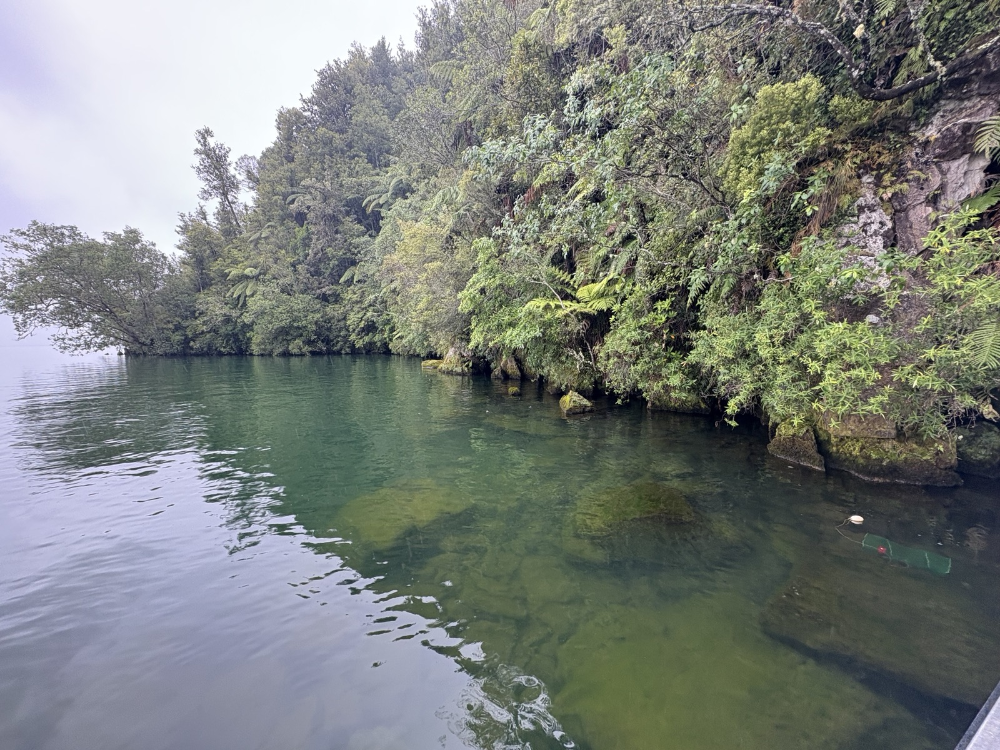

::: {.content-visible when-profile="thesis"}
```{=latex}
\clearpage
\providecommand{\chaptermark}[1]{}
\ifcsname c@chapter\endcsname
\setcounter{chapter}{3}
\setcounter{section}{0}
\addcontentsline{toc}{chapter}{\protect\numberline{3}Where do K\={o}ura Live?}
\chaptermark{Where do K\={o}ura Live?}
\fi
\providecommand{\thechapter}{3}
\thispagestyle{empty}
\begin{tikzpicture}[remember picture, overlay]
  \begin{scope}
    \clip ([yshift=-7cm]current page.north west)
          rectangle ([yshift=4.5cm]current page.south east);
    \node[inner sep=0pt, anchor=north]
      at ([yshift=-7cm]current page.north)
      {\includegraphics[height=18.2cm]{images/ch3_cover.jpg}};
  \end{scope}
  \fill[black]
    (current page.north west) rectangle ([yshift=-7cm]current page.north east);
  \node[color=thesissand, align=left,
        font=\fontsize{13}{16}\selectfont\sffamily, anchor=west]
    at ([xshift=1.5cm, yshift=-1.5cm]current page.north west)
    {Chapter \thechapter};
  \node[color=white, text width=0.85\paperwidth, align=left,
        font=\fontsize{22}{28}\selectfont\bfseries\sffamily, anchor=west]
    at ([xshift=1.5cm, yshift=-4cm]current page.north west)
    {Where do K\={o}ura Live?};
  \node[color=white, text width=0.85\paperwidth, align=left,
        font=\fontsize{10}{13}\selectfont\itshape\sffamily, anchor=north west]
    at ([xshift=1.5cm, yshift=-5.0cm]current page.north west)
    {Littoral habitat structure influences freshwater crayfish populations in five volcanic lakes of Aotearoa New Zealand};
  \fill[black]
    (current page.south west) rectangle ([yshift=4.5cm]current page.south east);
  \node[color=white, text width=0.85\paperwidth, align=left,
        font=\fontsize{9}{13}\selectfont\sffamily, anchor=west]
    at ([xshift=1.5cm, yshift=3.2cm]current page.south west)
    {Olivier V.\ Raven, Francis J.\ Burdon, Ian A.\ K.\ Kusabs, Robin Holmes \& Deniz Özkundakci};
  \node[color=thesissand, text width=0.85\paperwidth, align=left,
        font=\fontsize{9}{13}\selectfont\itshape\sffamily, anchor=west]
    at ([xshift=1.5cm, yshift=1.5cm]current page.south west)
    {Hydrobiologia (2026) --- https://doi.org/10.1007/s10750-026-06302-z};
\end{tikzpicture}
\null
\clearpage
```
:::

::: {.content-visible when-format="docx"}
Chapter 3 Where do Kōura Live?
Littoral habitat structure influences freshwater crayfish populations in five volcanic lakes of Aotearoa New Zealand

{fig-align="center" width=15cm}

Olivier V. Raven, Francis J. Burdon, Ian A. K. Kusabs, Robin Holmes & Deniz Özkundakci

*Hydrobiologia* (2026) - https://doi.org/10.1007/s10750-026-06302-z


:::

::: {.content-visible when-format="html"}
# Where do Kōura Live? {.unnumbered}
:::

```{r}
#| label: start-ch3
#| include: false

chapter_dir <- normalizePath(file.path(dirname(knitr::current_input(dir = TRUE)), "03_koura_shoreline_habitats"))
if (!dir.exists(chapter_dir)) chapter_dir <- normalizePath(dirname(knitr::current_input(dir = TRUE)))
fig_labels <- c("fig-koura-by-lake", "fig-occupancy-model", "fig-cpue-hurdle",
                 "fig-bpue-hurdle", "fig-length-weight", "fig-raw-data-all-predictors")
out_dir <- file.path(chapter_dir, "outputs")
dir.create(out_dir, showWarnings = FALSE, recursive = TRUE)

parent_knit_env <- knitr::knit_global()

qmd_lines <- readLines(file.path(chapter_dir, "analysis.qmd"), warn = FALSE)
in_r_chunk <- FALSE
r_lines <- character(0)
for (ln in qmd_lines) {
  if (grepl("^```\\{[rR]", ln)) { in_r_chunk <- TRUE; next }
  if (grepl("^```", ln) && in_r_chunk) { in_r_chunk <- FALSE; next }
  if (in_r_chunk) r_lines <- c(r_lines, ln)
}
r_lines <- c(
  paste0(".chwd <- setwd(", deparse(chapter_dir), ")"),
  r_lines,
  "setwd(.chwd)", "rm(.chwd)"
)
tmp_r <- file.path(chapter_dir, ".analysis_tmp.R")
writeLines(r_lines, tmp_r)
eval(parse(file = tmp_r, encoding = "UTF-8"))
unlink(tmp_r)
out_dir <- file.path(chapter_dir, "outputs")
ch3_out_dir <- out_dir

if (!all(file.exists(file.path(out_dir, paste0(fig_labels, ".png"))))) {
  .old_wd <- setwd(chapter_dir)
  knitr::knit(file.path(chapter_dir, "analysis.qmd"), output = tempfile(), quiet = TRUE, envir = parent_knit_env)
  setwd(.old_wd)
  for (lbl in fig_labels) {
    src <- knitr::fig_chunk(lbl, "png")
    if (file.exists(src)) file.copy(src, file.path(out_dir, paste0(lbl, ".png")), overwrite = TRUE)
  }
}
input_dir <- normalizePath(dirname(knitr::current_input(dir = TRUE)))
if (input_dir != chapter_dir) {
  thesis_out <- file.path(input_dir, "outputs")
  dir.create(thesis_out, showWarnings = FALSE, recursive = TRUE)
  file.copy(list.files(out_dir, full.names = TRUE, pattern = "\\.(png|jpg)$"), thesis_out, overwrite = TRUE)
}
knitr::opts_knit$set(root.dir = chapter_dir)
```

## Abstract {.unnumbered}
Freshwater crayfish are increasingly threatened by habitat degradation, declining water quality, and invasive species. In Aotearoa New Zealand, lake populations of the endemic northern freshwater crayfish *Paranephrops planifrons* (kōura) have declined by up to 91 %. Identifying key habitat requirements is essential to improve the conservation of crayfish facing multiple threats. To assess littoral habitat associations, we surveyed shoreline habitats in five Aotearoa lakes and modelled kōura occupancy, abundance, and biomass using generalised additive mixed models. Kōura occupancy increased with shoreline habitat complexity, particularly coarser substrate types and greater riparian vegetation cover. Elevated summer surface water temperatures were negatively associated with kōura occupancy and abundance, indicating reduced habitat suitability during warm periods. pH was positively correlated with kōura abundance and biomass. Our results suggest that the composition and physical structure of littoral habitats are important drivers of kōura distribution and abundance. As climatic drivers resulting in warmer water temperatures and reduced dissolved oxygen are difficult to manage, targeted protection and restoration of coarse substrate shoreline habitats may provide a practical conservation response.

## Introduction
Freshwater crayfish (Astacidea) play a vital role in freshwater ecosystems [@Momot1995]. They are ecosystem engineers, exerting substantial influence over key ecological processes, including nutrient cycling, organic matter decomposition and bioturbation [@Momot1995; @Collier1997; @Parkyn2001]. They are keystone species due to their broad trophic niche as predators and detritivores, and their ability to modify habitats through sediment excavation for burrow construction, removal of macrophytes, and alteration of macroinvertebrate communities [@Statzner2003; @Creed2004; @Usio2004; @Albertson2018]. Nearly one-third of the world’s crayfish species are currently threatened with extinction [@Richman2015]. Despite their ecological importance and imperilled status, crayfish are frequently overlooked in restoration and conservation initiatives [@Taylor2019; @Danilovic2022].

In Aotearoa New Zealand (hereafter Aotearoa), the endemic northern freshwater crayfish *Paranephrops planifrons* White, 1842, also known by its Māori name kōura, inhabits a wide range of freshwater environments, including rivers, streams and lakes across both main islands [@Hopkins1970]. Beyond its ecological role, kōura hold deep cultural significance, having historically been an important food source and trade commodity for iwi (Māori communities; [@Hiroa1921; @Kusabs2009]). However, kōura populations are increasingly threatened by climate change, invasive species and declining water quality [@Kusabs2015a; @Lee2025]. These declines are likely the result of multiple interacting environmental stressors, including declining water quality, deoxygenation and the introduction and consequent impacts of non-native species [@Kusabs2009]. For example, in Lakes Rotorua and Rotoiti, located in the Bay of Plenty region of Aotearoa’s North Island, kōura populations have declined by 76 % and 91 %, respectively, over the past two decades [@Kusabs2026]. 

In 2016, the invasive North American brown bullhead catfish (*Ameiurus nebulosus* Lesueur, 1819) was confirmed to be present in Lakes Rotorua and Rotoiti [@Grayling2020], where it now occurs in large numbers and preys heavily on kōura [@Francis2019; @Kusabs2026]. To reduce predation risk, kōura typically seek refuge in deeper lake habitats during the day and migrate to the more productive shallow areas at night to forage [@Devcich1979]. However, summer lake stratification has led to oxygen depletion in deeper waters, forcing kōura to spend more time in shallow habitats where predation risk is greater [@Dedual2002]. Climate change is expected to intensify these effects by strengthening thermal stratification and increasing the extent and duration of anoxic conditions in bottom waters as water temperatures rise [@Woolway2021; @Zhang2024]. In addition, dense beds of invasive macrophytes may obstruct kōura migration pathways between deep and shallow habitats [@Hessen2004; @Kusabs2009] and further reduce oxygen availability during seasonal macrophyte die-off events [@Vincent1984; @Hessen2004; @Hamilton2005].

Declines in kōura populations have cascading ecological impacts and implications for Māori cultural practices, including reduced opportunities for customary harvest and disruption of traditional activities [@Kusabs2009; @Kusabs2015a; @Kusabs2026]. To effectively conserve and restore populations requires an improved understanding of where kōura occur within lakes and what habitats are most important for sustaining healthy populations. Previous research in stream environments has shown that kōura preferentially occupy structurally complex habitats characterised by bank undercuts, woody debris, leaf litter, boulders and low flow velocities [@Usio2000; @Parkyn2004; @Jowett2008; @Parkyn2009]. In contrast, habitats used by kōura in lakes remains poorly understood, with previous studies largely focused on deeper offshore habitats [@Devcich1979; @Kusabs2009; @Kusabs2015b]. These studies suggest that benthic substrate characteristics may be more important than nutrient enrichment or predator abundance — specifically non-native rainbow trout (*Oncorhynchus mykiss* Walbaum, 1792) — in determining kōura distribution [@Kusabs2015b]. The littoral zone of lakes has received little attention, despite it being the most productive zone and supporting key life history processes of kōura [@Strayer2010], including nocturnal foraging and use by ovigerous females prior to juvenile release [@Devcich1979]. Consequently, the littoral zone is likely to represent an important habitat within lakes for kōura.

In this study, we examine which littoral habitat characteristics are associated with kōura occurrence, abundance and biomass across five Rotorua Te Arawa Lakes. We hypothesised that structurally diverse littoral habitats, including coarse substrates and native macrophytes, would be positively associated with kōura occurrence and abundance, as they provide physical refuge and foraging opportunities. Conversely, invasive submerged macrophytes were expected to have negative associations with kōura as these dense macrophytes hinder movement and reduce native biodiversity by displacing native macrophytes, altering habitat structure, and modifying ecological processes. We further expected that kōura abundance would be lower in lakes where catfish are present, as catfish are a known predator on benthic invertebrates and native fauna. By quantifying these habitat associations within the littoral zone, this study aims to inform targeted habitat protection and restoration strategies for the conservation of this culturally and ecologically important species.

## Materials and Methods
### Study location
Study sites were selected in five lakes located in the Rotorua Te Arawa Lakes area in the North Island of Aotearoa. The Lakes Rotorua, Rotoiti, Rotoehu, Rotomā, and Ōkāreka are located on a warm- temperate volcanic plateau (280-355 m) where winters are mild and year-round temperatures typically varies from 4°C to 24°C. The lakes span a wide range of morphometric and trophic conditions from shallow polymictic eutrophic systems (Rotoehu, maximum depth 14 m) to deep stratified oligotrophic lakes (Rotomā, maximum depth 83 m). Shorelines are characterised by a mix of native riparian vegetation, exotic pasture, and low-density residential development, with several lakes also supporting stands of emergent macrophytes. Detailed lake characteristics and shoreline composition are summarised in @tbl-lake-overview. All five lakes have populations of kōura, and brown bullhead catfish was present in Lakes Rotorua and Rotoiti at time of sampling [@Kusabs2026].

To survey these lakes, a stratified-random survey design was developed. The entire accessible shoreline of each lake was first mapped using aerial photos and then ground truthed and classified into dominant habitat types. Classification used the following criteria: a habitat was considered dominant “rocky” if the combined percentage of bedrock, boulders, and cobble exceeded 25 % by surface area; “sandy” if sand was the dominant sediment (≥50 %) and rocky conditions were not met; “muddy” if soft mud or organic matter was dominant and rocky/sandy conditions were not met; and “emergent macrophyte” if emergent native macrophytes exceeded 25 % of the shoreline cover by surface area. Shoreline sites exceeding two meters in depth or classified as geothermal were excluded, as these conditions were either unsuitable for kōura or inaccessible for field sampling.

For each lake, the total shoreline length of each habitat type within this sample frame was calculated in a projected coordinate system (New Zealand Transverse Mercator 2000; EPSG:2193). To ensure balanced representation of littoral habitat types across systems and to avoid confounding lake identity with sampling effort, an equal number of sites (n = 12) was surveyed in each lake, with sites allocated proportionally among the dominant shoreline habitat types. All selected sites were fully accessible for fieldwork, and therefore an oversample was not required. Within each habitat type, site locations were generated using the Generalized Random Tessellation Stratified (GRTS) design [@Stevens2004] executed using the spsurvey package in R [@Dumelle2023; @RCoreTeam2025], producing unbiased random coordinates without enforcing fixed spacing between sites. The final coordinates of the 12 random survey sites per lake were extracted directly from the GRTS output (@fig-site-map).

```{r}
#| echo: false
#| label: tbl-lake-overview
#| tbl-cap: "Physical, morphometric, and trophic characteristics of the five Rotorua Te Arawa Lakes surveyed, including sampling dates and number of littoral sites sampled per lake. Lake surface area, perimeter length, catchment area, depth, elevation, mixing regime, and trophic state for 2024 are derived from the @LAWA2025 database. Shoreline composition percentages are calculated from useable shoreline only, excluding geothermal and cliff sections."
if (knitr::is_latex_output()) {
  col_nms <- colnames(lake_data)

  # Build rotated LaTeX for cols 3-14 (injected AFTER kableExtra pipeline
  # to avoid kableExtra re-escaping backslashes in col.names).
  # Must escape % → \% before injecting into LaTeX (% starts a comment).
  escape_latex_pct <- function(x) gsub("%", "\\%", x, fixed = TRUE)
  rotated_latex <- sapply(col_nms[3:14], function(x)
    paste0("\\rotatebox{90}{\\parbox{2.8cm}{\\raggedright ", escape_latex_pct(x), "}}")
  )
  # Placeholder names: plain ASCII so kableExtra leaves them untouched
  placeholder_nms <- c(col_nms[1:2], sprintf("PHCOL%02d", 3:14))

  tbl <- knitr::kable(lake_data,
               booktabs = TRUE,
               linesep = "",
               col.names = placeholder_nms) %>%
    kableExtra::kable_styling(
      latex_options = "hold_position",
      full_width = FALSE,
      font_size = 8
    ) %>%
    kableExtra::add_header_above(
      c(" " = 10, "Shoreline composition (%)" = 4),
      bold = TRUE
    ) %>%
    kableExtra::column_spec(1, width = "2.2cm") %>%
    kableExtra::column_spec(2, width = "1.8cm") %>%
    kableExtra::column_spec(3:14, width = "0.9cm")

  # Replace placeholders with rotated LaTeX in the generated string
  tbl_str <- as.character(tbl)
  for (i in 3:14) {
    tbl_str <- gsub(sprintf("PHCOL%02d", i), rotated_latex[i - 2], tbl_str, fixed = TRUE)
  }

  tbl <- structure(
    paste0("\\begin{landscape}\n", tbl_str, "\n\\end{landscape}"),
    class = "knitr_kable",
    format = "latex"
  )
  tbl
} else {
  knitr::kable(lake_data)
}
```

{#fig-site-map}

### Data collection
In total, 60 sampling sites were sampled once in the Austral spring/summer from October 2024 to February 2025. Each sampling site measured 15 × 10 m and extended from the shoreline into the lake. At locations with unstable lake margins or depths exceeding 1 m, observations and measurements were conducted from a boat. At each site, physical, chemical and biological parameters were recorded (@tbl-environmental-biotic-overview).

```{r}
#| echo: false
#| label: tbl-environmental-biotic-overview
#| tbl-cap: "Overview of environmental and biotic variables measured at littoral sampling sites, including variable descriptions, units, and hypothesised relevance for kōura (*Paranephrops planifrons*). Variables were selected a priori based on known habitat requirements, physiological constraints, and potential biotic interactions influencing kōura occurrence, abundance, and biomass in lake littoral zones."
if (knitr::is_latex_output()) {
  tbl <- knitr::kable(biotic_vars,
               booktabs = TRUE,
               linesep = "") %>%
    kableExtra::kable_styling(
      latex_options = "hold_position",
      font_size = 7,
      full_width = FALSE
    ) %>%
    kableExtra::column_spec(1, width = "2.5cm") %>%
    kableExtra::column_spec(2, width = "3.5cm") %>%
    kableExtra::column_spec(3, width = "9.5cm") %>%
    kableExtra::column_spec(4, width = "5.0cm")
  tbl <- structure(
    paste0("\\begin{landscape}\n", as.character(tbl), "\n\\end{landscape}"),
    class = "knitr_kable",
    format = "latex"
  )
  tbl
} else {
  knitr::kable(biotic_vars)
}
```

Physical characteristics were assessed using both visual estimates and field measurements. Substrate composition was visually estimated with an underwater viewing chamber, as water clarity was sufficiently clear at all sites, using a standardised classification scheme, categorising bedrock, boulders (>256 mm), cobble (64–256 mm), gravel (2–64 mm), sand (0.063–2 mm), mud (<0.063 mm), and organic matter. A substrate index was then calculated from these estimates using a formula adapted to include fine organic matter and mud [@Jowett1990; @Jowett2008; @Harding2009]:

$$
\begin{aligned}
\text{Substrate index} &= 0.08 \times (\text{bedrock}) + 0.07 \times (\text{boulders}) \\
&\quad + 0.06 \times (\text{cobble}) + 0.04 \times (\text{gravel}) + 0.03 \times (\text{sand}) \\
&\quad + 0.02 \times (\text{organic matter}) + 0.01 \times (\text{mud})
\end{aligned}
$$

Larger substrate classes were assigned higher weights because coarse substrates such as cobble and boulders create greater interstitial pore spaces and stable structures that kōura use as refuge from predators. Coarse substrate availability has been shown to mediate crayfish vulnerability to predation and directly influence crayfish abundance in lakes [@Usio2000; @Nystrom2006], whereas fine substrates such as silt and mud alone offer limited physical refugia. Fine substrates were assigned near-zero coefficients (0.01–0.03), making their contribution to the index minimal relative to coarse substrates (0.06–0.08), consistent with the positive-weighting structure of the original index [@Jowett1990]. Riparian vegetation, overhanging tree cover, and wood debris was visually estimated as percentage cover within each site, along with emergent, submerged, and turf vegetation cover. To assess proximity to deeper waters, slope was calculated as horizontal distance from the shoreline to the 5 m depth contour derived from bathymetric maps. Chemical parameters included water temperature (°C), dissolved oxygen (mg L$^{-1}$), and conductivity ($\mu$S cm$^{-1}$), measured with a YSI ProSolo meter (Pro2030 Dissolved Oxygen and Conductivity Meter, YSI Inc., Yellow Springs, OH, USA) and pH was determined using a handheld pH meter (EC-PCTestr35, Eutech Instruments Pte Ltd, Paisley, UK).

Catch data for kōura and fish were collected using two single-winged, double-throated fyke nets (600 mm high D-shaped entrance hoop) and two collapsible bait traps baited with trout flesh (480 × 250 mm; two 50 mm entrance openings). Fyke nets were placed perpendicular to the shoreline at 10 m intervals, with bait traps positioned between them. All equipment was deployed simultaneously at each site for a 24-h period. The use of two fyke nets and two baited bait traps per site was intended to maximise detection probability across habitat types. Captured kōura were measured for orbital carapace length (OCL) using a digital calliper (0.01 mm precision; 150 mm) and for wet mass using a digital scale (±1 g; 5 kg capacity, Anko Brand, Kmart Group, Mulgrave, VIC, Australia). Catfish and other fish species, including eels (*Anguilla* spp.), goldfish (*Carassius auratus* (Linnaeus, 1758)), common smelt (*Retropinna retropinna* (Richardson, 1848)), kōaro (*Galaxias brevipinnis* Günther, 1866), rainbow trout, common bully (*Gobiomorphus cotidianus* McDowall & Fulton, 1978), and mosquitofish (*Gambusia affinis* (S. F. Baird & Girard, 1853)), were recorded for abundance and measured for total length, and weighed for wet mass. Catch per unit effort (CPUE) and biomass per unit effort (BPUE) were calculated for all kōura and fish based on the number of nets and traps used at each site [@Kusabs2015b]. Missing kōura weights due to failure of scale (n = 81) were estimated using a log₁₀–log₁₀ length–weight regression fitted to individuals with both measurements (n = 240), following standard approaches for weight length relationships in aquatic organisms ([(@fig-length-weight)]{.content-visible when-profile="thesis"}[(Fig. S1)]{.content-visible unless-profile="thesis"}) [@Froese2006]. Predicted values were back-transformed with a lognormal bias correction factor $10^{0.5 \sigma^2}$ [@Quinn2002].

$$
\log_{10}(\text{Weight [g]}) = -2.938 + 2.864 \times \log_{10}(\text{OCL length [mm]})
$$

### Data analyses
Because each site was sampled only once, imperfect detection could not be estimated separately from occupancy. Presence–absence data therefore reflect observed detections at the time of sampling, and sites where kōura were not captured were treated as absences in the models. As a result, inference focuses on relative associations between kōura occurrence and environmental or biotic predictors, rather than on estimating true occupancy probabilities.

Kōura presence or absence, CPUE, and BPUE were analysed using mixed-effects models to account for non-independence among sampling sites [@Bolker2009]. To test for differences among lakes, kōura presence was modelled using a binomial generalised linear mixed model (GLMM; logit link). CPUE and BPUE were modelled using Tweedie GLMM (log link), which is appropriate for continuous non-negative data with high frequency of zeros, as common in ecological count and biomass data [@Shono2008]. These models were fitted using the glmmTMB package [@Brooks2017], with habitat type included as a random intercept.
To identify environmental and biotic predictors associated with kōura distribution and abundance, GAMMs were implemented with the mgcv package [@Wood2004; @Wood2017]. To reduce multicollinearity, predictors were screened using Variance Inflation Factors (VIFs) calculated from linear models fitted to the fixed-effect design matrix. A conservative threshold of VIF > 5 was applied [@Quinn2002; @Kutner2005]. Across all model sets, dissolved oxygen expressed as percentage saturation (DO %) exceeded this threshold and was excluded from further analyses, while dissolved oxygen concentration (DO mg L$^{-1}$) was retained.

For occupancy analyses, kōura presence–absence was modelled using a binomial GAMM with a logit link function [@Zuur2009; @Wood2017]. For CPUE and BPUE, a hurdle modelling approach was adopted due to the high frequency of zero observations in the data. In this approach, occurrence (zero vs non-zero values) was modelled using a binomial GAMM with a logit link, followed by modelling of positive CPUE or BPUE values using Gamma GAMMs with a log link. This framework allows occurrence and positive abundance to be modelled separately and is appropriate for datasets characterised by many zero observations. Hurdle models are commonly used with freshwater crayfish catch data, which often possess these features [@Rosewarne2013]. Environmental and biotic predictors considered included substrate index, slope to 5 m depth, riparian vegetation, overhanging trees, wood cover, aquatic vegetation classes (emergent native, submerged native, submerged non-native, and emergent non-native vegetation), water temperature (°C), dissolved oxygen (mg L$^{-1}$), pH, specific conductivity ($\mu$S cm$^{-1}$), and the presence of catfish, eels, goldfish, and common smelt. Continuous predictors were centred and standardised prior to modelling to improve convergence and facilitate comparison of effect sizes and were modelled as smooth terms using thin plate regression splines (bs = 'ts'), which apply additional shrinkage to penalise overly complex relationships and can shrink smooth terms fully to zero during selection [@Wood2017]. Basis dimensions (k) were set based on the number of unique values per predictor and adjusted where necessary to balance flexibility and parsimony. Binary predictors (fish presence variables) were included as parametric terms.

Model selection was performed using maximum likelihood estimation with stepwise backward elimination, sequentially removed and the model refitted until all remaining terms met the retention threshold ($\alpha$ ≤ 0.05). Reduced models were compared with their respective full models using likelihood ratio tests and Akaike Information Criterion (AIC) scores. Final selected models were refitted using restricted maximum likelihood (REML), which accounts for the degrees of freedom associated with fixed effects and provides less biased estimates of variance components, resulting in more stable smoothing parameter estimates in models with random effects. Lake identity was included as a random effect in all GAMMs to account for spatial clustering and non-independence among observations and was not subject to the variable selection procedure [@Zuur2009].

Model diagnostics were performed to evaluate model fit and assumptions. Residuals were inspected to assess homogeneity of variance and normality [@Zuur2009]. Concurvity, the degree to which smooth terms can be approximated by other smooths in the model, was assessed to identify potential instability in smooth term estimates [@Wood2017]. Basis dimension checks using effective degrees of freedom (edf) were performed to ensure smoothing terms had sufficient flexibility to capture underlying patterns without overfitting [@Zuur2009]. For binomial components, model discrimination was evaluated using Receiver Operating Characteristic and Area Under the Curve (ROC/AUC), where values approaching 1 indicate perfect discrimination between presences and absences [@Fielding1997]. For positive-only abundance models, predicted versus observed values were compared to assess how well the model reproduces observed CPUE and BPUE values across the range of the data.

To provide context for the association between catfish presence and kōura metrics detected in the GAMM, a descriptive comparison of kōura presence rate, CPUE, and BPUE was conducted across catfish-present and catfish-absent sites, and across lakes with and without catfish.

## Results
A total of 321 kōura were captured across 33 of the 60 surveyed sites within the five Rotorua Te Arawa Lakes. Kōura OCL ranged from 7–53 mm and individual body mass from 0.2–87 g. Kōura were detected in all five lakes; however, abundance varied among lakes, with total counts ranging from 19 to 112 individuals. Mixed-effects models indicated a significant effect of lake on kōura occupancy (binomial GLMM: likelihood ratio test, `r report_lrt(pres_lrt)`), CPUE (Tweedie GLMM: `r report_lrt(cpue_lrt)`), and BPUE (Tweedie GLMM: `r report_lrt(bpue_lrt)`; @fig-koura-by-lake).

{#fig-koura-by-lake width=3in}

The five lakes differed substantially in environmental and biotic characteristics ([(@tbl-an-env-fish-summary)]{.content-visible when-profile="thesis"}[(Table S1)]{.content-visible unless-profile="thesis"}). Physical habitat structure varied among lakes, with differences in substrate index, nearshore slope, and littoral vegetation cover. Emergent macrophytes were absent from Lake Rotorua but present in the other lakes, particularly Ōkāreka, while submerged macrophyte cover at the shore was rare in Rotorua and Rotoiti but more extensive in Rotoehu and Rotomā. Water chemistry also differed markedly among lakes. Surface water temperatures were highest in Rotorua and lowest in Rotomā and Ōkāreka, while pH ranged from circum-neutral conditions in Rotorua to more alkaline conditions in Rotoehu and Rotoiti. Specific conductivity showed strong contrasts, being highest in Rotoehu and lowest in Ōkāreka. Dissolved oxygen concentrations in the littoral zone varied less among lakes but were generally lowest in Rotorua. Fish populations differed between lakes, reflecting invasion history. Catfish were detected only in Lakes Rotorua and Rotoiti, whereas goldfish occurred in all lakes but were most abundant in Rotoehu. Common bullies were found in every survey location. Trout were found sporadically in Rotorua, Rotoiti and Ōkāreka and kōaro were only caught from Ōkāreka.

### Kōura occupancy
The full binomial GAMM for kōura occupancy explained `r round(mc_val("Occupancy", "dev_full"), 1)` % of the deviance (AIC = `r round(mc_val("Occupancy", "aic_full"))`; adj. R² = `r round(mc_val("Occupancy", "r2_full"), 3)`). Stepwise ML reduction ($\alpha = 0.05$) retained riparian vegetation, substrate index, temperature, and specific conductivity as smoother terms, lake identity as a random effect, and the presence of goldfish (negative) and catfish (positive) as parametric terms. The final model refitted using REML explained `r round(mc_val("Occupancy", "dev_final"), 1)` % of the deviance (adj. R² = `r round(mc_val("Occupancy", "r2_final"), 3)`) and retained positive influences of riparian vegetation (`r get_pval("Occupancy", "Riparian_vegetation")`), substrate index (`r get_pval("Occupancy", "Substrate_index")`), specific conductivity (`r get_pval("Occupancy", "Specific_conductivity")`) and a negative influence of temperature (`r get_pval("Occupancy", "Temperature")`), as significant smoother terms (@fig-occupancy-model a). The random effect of lake identity was not statistically significant (`r get_pval("Occupancy", "LID")`), indicating limited residual variation between lakes after accounting for environmental and biotic predictors. Among the parametric covariates, goldfish had a significant negative relationship (`r get_pval("Occupancy", "Presence_Goldfish")`), and catfish presence showed a significant positive relationship (`r get_pval("Occupancy", "Presence_Catfish")`). Model diagnostics showed no evidence of overfitting (edf < k) and good discrimination (AUC = 0.946; @fig-occupancy-model b). Concurvity diagnostics revealed high collinearity between specific conductivity and lake identity (worst-case = 1.00, observed = 0.94), and between temperature and lake identity (worst-case = 0.95, observed = 0.88), suggesting both predictors partly reflect between-lake differences. Residual diagnostics showed no systematic patterns in variance across fitted values, consistent with acceptable model fit for a binomial GAMM. The calibration plot indicated slight under-prediction at low probabilities and slight over-prediction at mid-range probabilities (@fig-occupancy-model c). The binomial components of the CPUE and BPUE hurdle models produced the same structure and effect directions as the occupancy model, so only the positive Gamma components are reported here.

![Kōura occupancy GAMM results and model performance. a) Estimated smooth terms for riparian vegetation, substrate index, surface water temperature, and specific conductivity, shown as partial effects with 95% confidence intervals. See Fig. S2 for raw data underlying modelled relationships. b) Receiver operating characteristic (ROC) curve illustrating model discrimination, with the area under the curve (AUC) reported. c) Calibration plot based on five equal-frequency bins, comparing mean predicted occupancy probabilities with observed proportions of occupied sites; the dashed 1:1 line indicates perfect calibration.](outputs/fig-occupancy-model.png){#fig-occupancy-model width=6.5in}

### Kōura CPUE
The full Gamma GAMM for positive CPUE explained `r round(mc_val("CPUE (pos)", "dev_full"), 1)` % of the deviance (AIC = `r round(mc_val("CPUE (pos)", "aic_full"))`; adj. R² = `r round(mc_val("CPUE (pos)", "r2_full"), 2)`; n = 33). Stepwise selection ($\alpha = 0.05$) reduced the model to temperature, pH, and emergent native macrophytes as smoother terms, lake identity as a random effect, and the presence of common smelt (negative) as a parametric effect. This reduced model achieved a lower AIC (`r round(mc_val("CPUE (pos)", "aic_reduced"))`) and explained `r round(mc_val("CPUE (pos)", "dev_reduced"), 1)` % of the deviance (adj. R² = `r round(mc_val("CPUE (pos)", "r2_reduced"), 3)`). Likelihood ratio tests indicated that the reduced model was statistically equivalent to the full model (*p* = `r formatC(mc_val("CPUE (pos)", "lrt_p"), format = "f", digits = 3)`), and it was therefore selected as the final CPUE model.

The final REML-fitted model explained `r round(mc_val("CPUE (pos)", "dev_final"), 1)` % of the deviance (adj. R² = `r round(mc_val("CPUE (pos)", "r2_final"), 3)`) and retained positive influence of pH (`r get_pval("CPUE (pos)", "pH")`) and negative influence of temperature (`r get_pval("CPUE (pos)", "Temperature")`) and emergent native macrophytes (`r get_pval("CPUE (pos)", "Emergent_Native")`) as significant smooth predictors (@fig-cpue-hurdle a). The lake identity random effect was not significant (`r get_pval("CPUE (pos)", "LID")`), indicating minimal additional between lake variation once environmental covariates were included. Presence of common smelt had a significant negative parametric relationship (`r get_pval("CPUE (pos)", "Presence_Common_smelt")`). Concurvity diagnostics indicated strong correlation between temperature and pH, but both variables were retained because they were ecologically interpretable and contributed significantly to model fit. Model diagnostics showed no evidence of overfitting (edf < k), and predictive accuracy was moderate (@fig-cpue-hurdle b). Residual diagnostics showed no systematic patterns in residual variance across fitted values. The model tended to slightly over-predict very low CPUE values and under predict the highest observations.

![Kōura CPUE GAMM results and model performance. a) Estimated smooth terms for surface water temperature, pH, and emergent native macrophytes, shown with partial effects and 95% confidence intervals. See Fig. S2 for raw data underlying modelled relationships. b) Predicted versus observed CPUE from the positive (Gamma) component of the hurdle model, with predictions excluding the random lake effect. The dashed 1:1 line indicates perfect agreement; annotated values report R² and RMSE to summarise model fit.](outputs/fig-cpue-hurdle.png){#fig-cpue-hurdle width=5in}

### Kōura BPUE
The full Gamma GAMM for positive BPUE explained `r round(mc_val("BPUE (pos)", "dev_full"), 1)` % of the deviance (AIC = `r round(mc_val("BPUE (pos)", "aic_full"))`; adj. R² = `r round(mc_val("BPUE (pos)", "r2_full"), 2)`; n = 33). Stepwise ML selection ($\alpha = 0.05$) retained pH, emergent native macrophytes, and the lake identity random effect. The resulting reduced model had a higher AIC (`r round(mc_val("BPUE (pos)", "aic_reduced"))`) and explained `r round(mc_val("BPUE (pos)", "dev_reduced"), 1)` % of the deviance (adj. R² = `r round(mc_val("BPUE (pos)", "r2_reduced"), 3)`). As the full model was overfitting the data the reduced model was chosen for inference.
The final REML-fitted BPUE model explained `r round(mc_val("BPUE (pos)", "dev_final"), 1)` % of the deviance (adj. R² = `r round(mc_val("BPUE (pos)", "r2_final"), 2)`) and retained a positive influence of pH (`r get_pval("BPUE (pos)", "pH")`) and a negative influence of emergent native macrophytes (`r get_pval("BPUE (pos)", "Emergent_Native")`) as significant, near-linear smoothing (@fig-bpue-hurdle a). The emergent macrophyte effect, while statistically significant, was close to the threshold and should be interpreted with caution given the distributional limitations of the model. The lake identity random effect was not significant (`r get_pval("BPUE (pos)", "LID")`), indicating minimal additional between lake variation after accounting for environmental predictors. Diagnostic checks showed appropriate basis dimensions (edf < k), stable convergence, and acceptable levels of observed concurvity, though minor departure from distributional assumptions was noted at the lower tail, likely reflecting a small number of high-biomass sites. Predictive accuracy was moderate (@fig-bpue-hurdle b), with a tendency for the model to under predict the highest BPUE values.

{#fig-bpue-hurdle width=4in}

## Discussion
We found that local and site-scale habitat characteristics were consistently associated with kōura occurrence and abundance across the five surveyed lakes. Although initial mixed-effects models identified significant differences in kōura occupancy, Catch Per Unit Effort (CPUE), and Biomass Per Unit Effort (BPUE) among lakes, these differences were no longer evident once local environmental and biotic predictors were incorporated into the Generalised Additive Mixed-Models (GAMMs). However, interpreting the non-significance of lake identity in the final models requires caution. In the occupancy model, both temperature and specific conductivity showed near-perfect collinearity with lake identity, suggesting these predictors likely absorbed between-lake differences rather than capturing purely within-lake habitat associations. Given that predictors were often correlated at the site scale, the GAMMs are best interpreted as identifying habitat associations rather than mechanistic drivers of kōura distribution. The predictors substrate index and riparian vegetation cover, which varied considerably within lakes, likely reflect genuine within-lake habitat associations. Consequently, targeted management actions that improve local habitat structure and address key biotic pressures at finer spatial scales have the potential to deliver local gains, particularly where whole-lake interventions are not feasible or where local habitat degradation is the dominant stressor.

### Habitat associations with kōura
Kōura occurrence was consistently associated with coarser substrate types and greater riparian vegetation cover. Substrate heterogeneity was moderately negatively correlated with the substrate index (r = −0.48), indicating that the index reflects dominance of coarse substrates rather than proportional mixing of particle sizes. Higher substrate index values therefore reflect the presence of large particles like bedrock, boulders and cobbles, which create large interstitial pore spaces that function as physical refugia, providing shelter from predators [@White2003; @Haschenburger2009; @Kusabs2015b]. The relationship between substrate size and benthic invertebrates is not linear [@Quinn1990], where larger pore spaces between coarse particles may favour adult kōura, smaller interstitial spaces within mixed substrates may provide refugia for juveniles, suggesting that heterogenous substrates support kōura across life stages. However, mixed substrates containing both coarse and fine particles can reduce pore space availability as smaller particles infill void spaces between larger ones [@Haschenburger2009], meaning that dominance of coarse substrate rather than substrate heterogeneity is the more relevant driver of refugia availability for adults. Additionally coarse substrates may facilitate burrowing by kōura at the margins of rocky areas where softer sediments are accessible, providing an additional form of refuge [@Usio2000]. Similar preferences for coarse substrates have been reported in stream environments [@Olsson2006; @Jowett2008], although the optimal substrate size may differ between habitat types. In streams, kōura show a non-linear response to substrate size with an optimum around 130 mm, with probability of occurrence declining at boulder substrates larger than 256 mm, likely because larger substrates are associated with higher flow velocities that kōura actively avoid [@Jowett2008]. Coarse particles in streams are also relatively stable under typical flow conditions, as their size reduces the likelihood of transport during high flows. In lakes, where flow is minimal, kōura may preferentially use larger substrates such as boulders, as this constraint is removed and larger particles create more accessible interstitial refugia. However, substrate stability in these volcanic lakes remains relevant in wave-exposed littoral zones, as pumice substrates, being lighter than other lithologies of similar size, are more likely to redistribution during wave action, potentially reducing the stability of interstitial refugia. Although fyke net deployment is more challenging in highly structured rocky habitats and may lead to conservative abundance estimates, the consistent positive association with the substrate index across all five lakes highlights the importance of coarse littoral substrates for kōura.

This refugia mechanism also helps explain why emergent macrophyte habitats were negatively associated with kōura abundance and biomass despite providing vertical structure. Emergent native macrophytes, including raupō (*Typha orientalis* C.Presl) and giant spike rush (*Eleocharis sphacelata* R.Br.), often form in relatively homogeneous habitats, characterised by fine sediments and high organic matter accumulation in sheltered littoral areas [@Chambers1987; @Lishawa2023]. Such conditions may limit the availability of effective refuges, reduce foraging efficiency, and increase oxygen demand associated with organic decomposition, with dissolved oxygen also likely to exhibit greater unmeasured daily variability within macrophyte stands [@Bunch2010; @Schrank2019]. Therefore, rocky shorelines maintain accessible interstitial pore spaces that function as refugia, whereas macrophyte-dominated habitats accumulate fine sediments that infill potential void spaces and reduce refugia availability. However, the negative association between emergent native macrophytes and kōura abundance and biomass should be interpreted with caution. Only 15 of 60 sites had emergent macrophyte cover and in the CPUE and BPUE models this was 7 of 33 positive sites, meaning model estimates for this predictor carry greater uncertainty than the smooth term confidence intervals suggest. That a consistent negative effect was nonetheless detected across both CPUE and BPUE models suggests the relationship is ecologically meaningful despite the limited representation of this habitat type in the dataset.

### Fish associations as indicator of habitat quality
Associations between kōura abundance and the presence of certain fish species further support the importance of habitat-mediated processes rather than direct biotic interactions. Goldfish presence was negatively associated with kōura occupancy, and common smelt presence was negatively associated with kōura CPUE. Goldfish are typically associated with warmer, vegetated littoral habitats with finer substrates [@Fry1948; @Ford2005], conditions that were also unfavourable for kōura in this study. Goldfish presence is therefore best interpreted as an indicator of habitat conditions that are unsuitable for kōura rather than as a direct driver of kōura distribution. Similarly, common smelt are primarily pelagic [@Rowe1993], and their association with reduced kōura abundance is unlikely to reflect direct interactions. Instead, this pattern may reflect broader lake-scale trophic or environmental gradients, such as increased predation pressure mediated through shared predators [@Schoen2015].

A weak positive association between catfish presence and kōura occupancy was detected in the GAMM, although this pattern should be interpreted cautiously. Catfish were restricted to lakes Rotorua and Rotoiti, occurring at only 6 of 24 sites within these two lakes. Examining this association across multiple spatial scales reveals a scale-dependent pattern consistent with [@Levin1992], who demonstrated that ecological relationships could shift direction depending on the scale of analysis. At the lake scale, kōura presence, CPUE, and BPUE were all substantially lower in catfish-invaded lakes than in catfish-free lakes, suggesting a negative association. At the site scale within invaded lakes, catfish-present sites also had lower kōura presence rates and abundance than catfish-absent sites. The positive parametric term in the GAMM therefore likely resulted from habitat covariate adjustment, where catfish and kōura co-occur in coarse substrate littoral habitats that support higher benthic invertebrate biomass and historically higher kōura densities [@Barnes1996; @Barnes2003]. Importantly, the positive GAMM term does not preclude strong negative impacts of catfish during earlier stages of invasion; instead, current distributions may represent a residual distribution following substantial historical declines, with kōura persisting at reduced densities in habitats where stable coexistence is possible [@Kusabs2026]. Overall, fish associations observed in this study appear to reflect shared responses to habitat structure and productivity rather than direct biotic regulation of kōura populations.

### Associations with physico-chemical drivers
Elevated summer water temperatures were negatively associated with kōura abundance in both occupancy and CPUE models, indicating that thermal conditions impose an important constraint on littoral habitat suitability. Lakes were surveyed at different times across the spring-summer period, so between-lake temperature differences partly reflect when each lake was sampled, not only differences in thermal regime. Kōura are known to be temperature-sensitive, with activity increasing above approximately 10 °C and temperatures exceeding ~21 °C considered thermally stressful, and probably leading to aestivation [@Devcich1979; @Angilletta2004; @Hammond2006; @Hesni2009]. During the study period, surface water temperatures in several lakes exceeded this threshold, including a mean summer temperature of 23.15 °C in Lake Rotorua, conditions likely to reduce suitable habitat availability during warm periods.

In stratified lakes, elevated surface temperatures may further constrain kōura habitat by intensifying thermal stratification and limiting oxygen availability in deeper waters [@Wetzel2001]. Lake Rotoiti and Ōkāreka, for example, experience extended stratification and reduced bottom-water oxygen concentrations during the summer periods [@vonWesternhagen2010], conditions that may restrict kōura to warmer nearshore or surface habitats where thermal stress is also elevated. Although vertical movements and depth-specific habitat use were not assessed directly, the negative association between temperature and kōura abundance observed here is consistent with broader constraints on habitat suitability arising from the combined effects of thermal stress and reduced oxygen availability during prolonged stratification, rather than from surface temperature alone. Importantly, this temperature effect was detected independently of littoral habitat structure, suggesting that elevated summer temperatures may compress kōura into a narrower subset of thermally and structurally suitable microhabitats, where local habitat characteristics may provide limited buffering but also increase vulnerability to predation and other stressors.

Because sampling was restricted to the spring/summer period, seasonal shifts in temperature tolerance and habitat use could not be evaluated. Nevertheless, projected climate warming is expected to increase surface water temperatures and extend the duration of thermal stratification in lakes, thereby intensifying summer thermal stress in shallow littoral zones and further reducing suitable kōura habitat during summer and autumn [@Jane2021].

In contrast to temperature effects on occurrence and abundance, water chemistry variables were more strongly associated with kōura abundance and biomass. They increased with higher pH and specific conductivity, with pH showing positive associations in both CPUE and BPUE models and conductivity positively associated with occupancy. Elevated pH values indicate carbonate-rich conditions that may enhance calcium availability, which is essential for exoskeleton formation, moulting, and growth in kōura [@Hammond2006]. Further, specific conductivity reflects the overall ionic composition of the water, which in volcanic lake systems may indicate differences in catchment geology and geothermal inputs, though given its near-perfect collinearity with lake identity the mechanistic interpretation of this association remains uncertain. Favourable chemical conditions are more likely to influence the amount of biomass that littoral habitats can support, rather than acting as strict determinants of kōura presence. This interpretation is consistent with physiological constraints associated with calcification and moulting, processes that become increasingly demanding as individuals increase in size [@Greenaway1985].

### Conclusions
Our study found that local littoral habitat complexity, particularly coarse substrate availability and riparian vegetation cover, were consistently associated with kōura occurrence and abundance in nearshore habitats. Elevated summer water temperature was negatively associated with kōura occurrence and abundance, consistent with thermal sensitivity of kōura, though this association partly reflects between-lakes differences and should be interpreted cautiously. Together, these findings suggest that both local habitat complexity and thermal conditions shape kōura distribution within the littoral zone. This study contributes to understanding of how habitat complexity structures influence freshwater crayfish populations and demonstrates that not all forms of structural complexity equally support biodiversity. Different forms of structural complexity likely support different species and ecological functions, meaning that maintaining diversity of habitat types within the littoral zone is important for broader biodiversity conservation [@Meerhoff2022]. As shoreline modification, sedimentation, and invasive macrophyte expansion continue to reduce variation and structural diversity in littoral habitats, understanding which components of habitat complexity are functionally important for target species becomes critical for effective restoration planning.

Climate warming is expected to impose increasing constraints on freshwater crayfish populations through rising summer water temperatures, prolonged periods of thermal stratification, and intensified interactions with non-native species that are better adapted to warmer conditions [@Capinha2013; @Lee2025]. While such broad-scale drivers are difficult to manage directly, local habitat conditions represent a tractable management lever. The strong association between kōura occurrence and coarse substrate availability suggests that an absence of interstitial refuge availability may act as a limiting factor freshwater crayfish populations in these systems. Accordingly, management actions that prioritise the protection and enhancement of coarse littoral substrates and riparian vegetation, including the targeted placement of rocks in areas already used by freshwater crayfish [@Johnsen2008], may help support the persistence and local recovery of populations in lakes and represent a practical approach to conserving functionally important habitat complexity in littoral ecosystems.

## Acknowledgements
We thank Te Arawa Lakes Trust and Te Komiti Whakahaere for the opportunity to study kōura in the Rotorua Te Arawa Lakes. We are grateful to Soweeta Fort-D’ath and William Anaru (Te Arawa Lakes Trust), and Tihini Grant (Ngāti Pikiao), for facilitating access to the lakes and supporting the field programme. We appreciate Joe Butterworth’s assistance with fieldwork, and the support of Andy Bruere and the Bay of Plenty Regional Council in helping to fund the fieldwork. We thank Calum MacNeil and three anonymous reviewers for feedback on an earlier version of this manuscript.

::: {.chapter-only}
### Funding statement
This research was supported by the Fish Futures programme funded through a Ministry of Business, Innovation and Employment grant (CAWX2101) with additional funding provided by the Bay of Plenty Regional Council under the Toihuarewa Waimāori - Bay of Plenty Regional Council Chair in Lake and Freshwater Science programme.

### Authors’ contributions
Study conception and design were undertaken by O.V.R., F.J.B., I.A.K.K., R.H., and D.Ö. Fieldwork was conducted by O.V.R. Data analysis was performed by O.V.R., with statistical advice from F.J.B. Local ecological and traditional knowledge was contributed by I.A.K.K. and R.H. Manuscript drafting was led by O.V.R. All authors contributed to manuscript revision, approved the results, and the final manuscript.

### Ethical approval
This study did not involve experimentation on humans or animals. Kōura and fish were captured using standard fisheries sampling methods. Permission to conduct field sampling and handle aquatic fauna was granted by Te Arawa Lakes Trust and Te Komiti Whakahaere. Formal institutional ethical approval was not required.

### Declarations
The corresponding author has declared that none of the authors has any competing interests.

### Data availability statement
The code and derived data supporting the findings of this study are openly available on GitHub (https://github.com/OlivierRaven/Koura_shoreline_habitats) and a rendered version of the analysis is hosted at https://olivierraven.github.io/Koura_shoreline_habitats/. The primary raw dataset and code are archived on Zenodo (https://doi.org/10.5281/zenodo.19476793). Peer review documents, including the cover letter and reviewer responses, are available in the manuscript repository in the interest of open and transparent science.
:::


